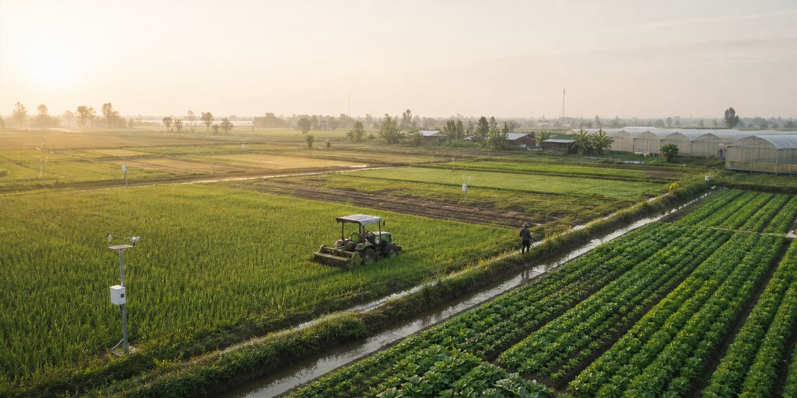
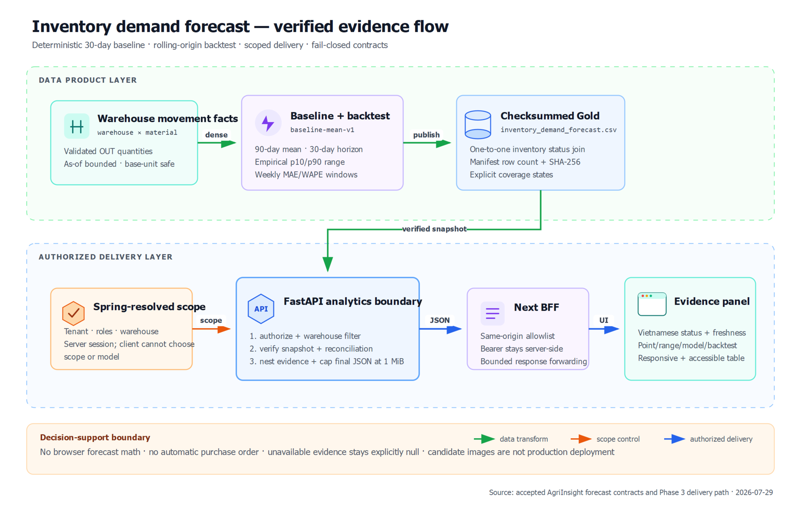
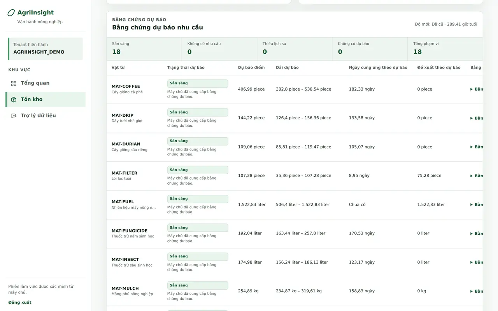
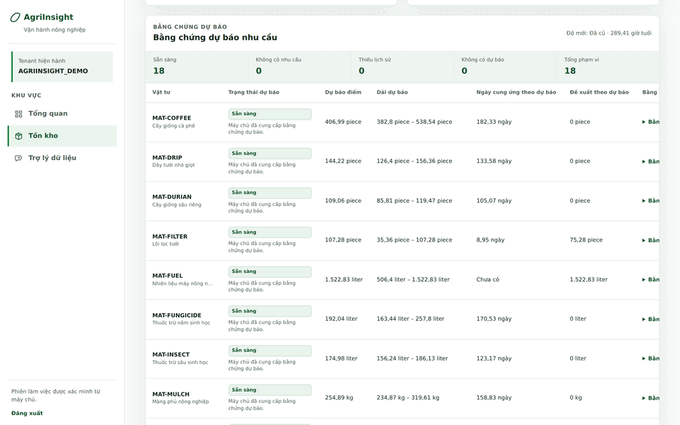
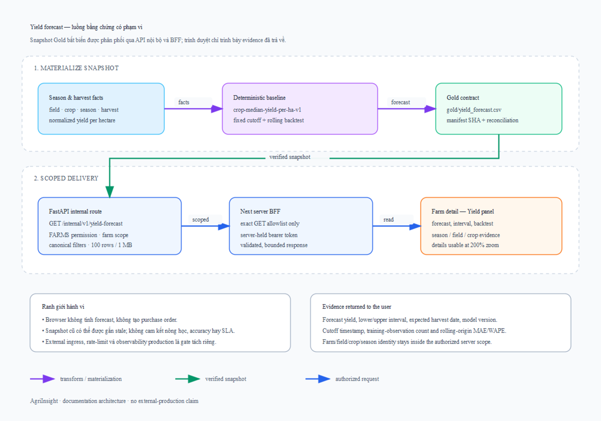
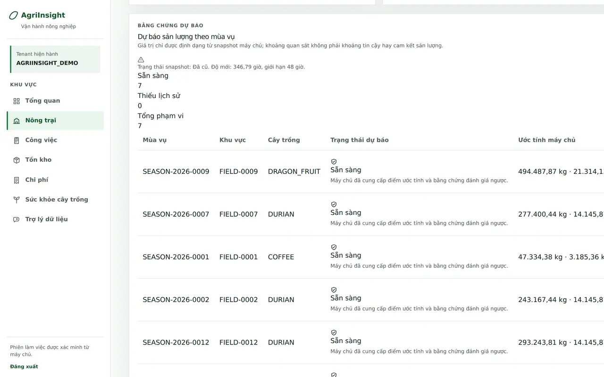
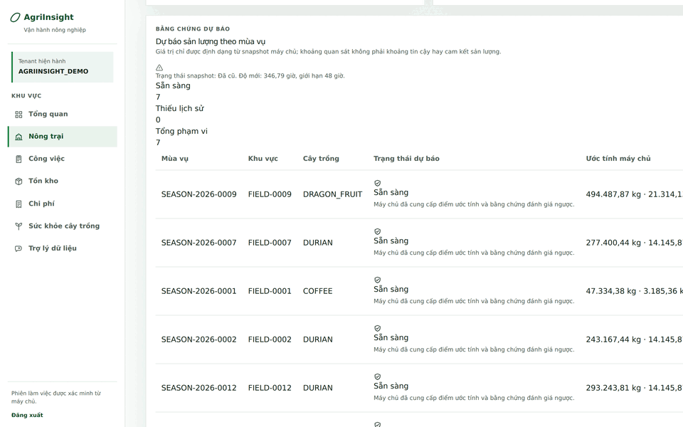
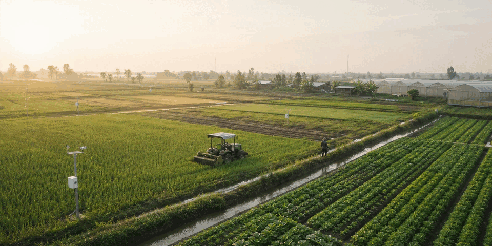

# AgriInsight

[](https://github.com/JasonTM17/AgriInsight/actions/workflows/ci.yml)
[](pyproject.toml)
[](backend/pom.xml)
[](web/package.json)



AgriInsight là nền tảng phân tích dữ liệu cho doanh nghiệp nông nghiệp. Bản
phát hành công khai [`v0.4.0`](https://github.com/JasonTM17/AgriInsight/releases/tag/v0.4.0)
được publish lúc `2026-08-01T12:01:05Z`; tag object
`4c27b343eecd32cf7daac462e5f661011e2af0df` peels to main SHA
`616527dcc7f4a03720fb48e617f9310ab9614873`. Exact-head CI
[`30697294137`](https://github.com/JasonTM17/AgriInsight/actions/runs/30697294137)
passed 10/10 trước khi tag, và protected Docker Hub/GHCR publication
[`30697808763`](https://github.com/JasonTM17/AgriInsight/actions/runs/30697808763)
passed 4/4. `v0.3.1`, `v0.3.0` và `v0.2.3` được giữ làm bằng chứng
lịch sử cho inventory forecasting, RAG và worker slices trước đó.

```text
Operational simulators → Bronze → Validation & quarantine → Silver
                       → Star-schema warehouse → Gold KPI/alerts
                       → Evidence-backed insight → Multi-domain dashboard
```

## Phạm vi đang chạy được

- Quản lý dữ liệu doanh nghiệp, trang trại, khu vực, cây trồng, mùa vụ, hoạt động chăm sóc và thu hoạch.
- Quản lý kho vật tư, nhà cung cấp, nhập/xuất kho, tồn hiện tại, days-of-supply, nhu cầu 30 ngày và ABC Analysis.
- Thu thập dữ liệu cảm biến, thời tiết và quan sát sâu bệnh; tính risk score cho từng khu vực.
- Chèn lỗi nguồn có chủ ý: trùng khóa, mã không chuẩn, đơn vị tấn/kg, số âm, giá trị cảm biến ngoài phạm vi và dữ liệu thiếu.
- Tách Bronze, Silver và quarantine; đo completeness, validity, uniqueness, freshness trước và sau xử lý.
- Nạp warehouse SQLite theo star schema, kiểm tra toàn bộ khóa ngoại trước khi thay thế database hiện hành.
- Vật hóa Gold contracts cho Executive, Farm Performance, Inventory, Cost Analysis, Crop Health và Data Quality.
- Sinh cảnh báo cùng khuyến nghị có bằng chứng dữ liệu; UI không tự tính lại logic KPI.
- Hỏi đáp RAG bằng DeepSeek V4 Flash trên Gold snapshot đã xác minh, có
  trích dẫn bắt buộc và từ chối khi không đủ bằng chứng.
- Chạy lặp lại an toàn theo seed/ngày chốt dữ liệu, có manifest, row count và SHA-256 checksum.

## Dự báo nhu cầu kho có bằng chứng



Baseline deterministic dự báo nhu cầu 30 ngày từ warehouse/material OUT facts,
giữ tối đa 180 ngày lịch sử và dùng 90 ngày dense gần nhất. Mỗi SKU-location
mang theo trạng thái coverage, model version, mốc dữ liệu, dải lập kế hoạch,
days-of-supply và rolling-origin MAE/WAPE. Hai chỉ số run-rate cũ vẫn tách biệt;
giao diện không tính lại dự báo và không tự tạo purchase order.





Ảnh và GIF được chụp từ hosted real-platform gate
[`30504951460`](https://github.com/JasonTM17/AgriInsight/actions/runs/30504951460)
trên Keycloak/PostgreSQL/Spring/FastAPI/Next/Chrome thật. Đây là bằng chứng
documentation/demo của baseline đã nghiệm thu, không phải external production
deployment, ground truth nông học hay cam kết accuracy/SLA của mô hình nâng cao.

## Dự báo năng suất có bằng chứng



Baseline `crop-median-yield-per-ha-v1` chỉ dùng harvest của các mùa cùng cây đã
hoàn tất trước forecast origin. Gold snapshot mang forecast kg/ha và gross kg,
dải lịch sử mô tả, model/version, cutoff, history và rolling-origin
MAE/WAPE. `GET /internal/v1/yield-forecast` chỉ nhận filter canonical
farm/field/crop/season với pagination tối đa 100 dòng và 1 MiB; BFF và browser
không chọn tenant/model/sort, không tính lại forecast và không tạo mutation.





Ảnh và GIF được chụp từ hosted real-platform gate
[`30696001895`](https://github.com/JasonTM17/AgriInsight/actions/runs/30696001895)
trên Keycloak/PostgreSQL/Spring/FastAPI/Next/Chrome thật. Đây là bằng chứng
documentation/demo của snapshot đã nghiệm thu, không phải external production
deployment, ground truth nông học, confidence interval hay cam kết
accuracy/SLA.

## Backend vận hành đang triển khai

Backend Java 21/Spring Boot nằm riêng trong `backend/`. Phase 1-6 đã được nghiệm thu đến ngày 2026-07-22; Phase 7 có transactional outbox, image hardening, CI, recovery wrappers và protected image publication đã được xác minh trong `v0.2.3`. Production deployment, OIDC operations và recovery-policy ownership vẫn là cổng riêng, chưa được bản phát hành container này phê duyệt. Nền tảng Next 16 hiện phủ chín khu vực `/overview`, `/farms`, `/work`, `/inventory`, `/costs`, `/crop-health`, `/data-quality`, `/assistant` và `/admin`; mọi dữ liệu/mutation đi qua BFF allowlist, Spring/FastAPI thật và session OIDC phía máy chủ. Backend vẫn giữ application foundation, deny-by-default OIDC security, exact identity bootstrap, database-backed roles/permissions, tenant/profile-scoped transactions, PostgreSQL FORCE RLS, durable idempotency/audit, farm-to-harvest APIs, inventory/procurement APIs với warehouse assignment, immutable ledger/projections, reversals, reconciliation và OpenAPI contracts, cùng operating-cost ledger V16-V17 với correction lineage và bounded summaries.

## Trợ lý dữ liệu DeepSeek RAG

`/assistant` là giao diện tiếng Việt cho một RAG pipeline có kiểm soát:

- Spring `/api/v1/me` xác định tenant, vai trò, farm và warehouse trước khi
  corpus được tạo; trình duyệt không được gửi tenant, model hoặc scope.
- Retriever lexical/structured chạy trên Gold snapshot đã xác minh, lọc scope
  trước khi xếp hạng và dùng evidence ID ổn định.
- DeepSeek V4 Flash chạy phía FastAPI với thinking tắt, JSON output, giới hạn
  timeout/token/concurrency, quota theo tenant và trích dẫn ở mọi câu khẳng
  định; phản hồi bị cắt hoặc có marker ngoài corpus bị từ chối.
- Next BFF giữ bearer token phía máy chủ, kiểm tra host/origin/session/CSRF,
  giới hạn body/response và không chuyển tiếp lỗi nhà cung cấp.
- Hội thoại chỉ ở bộ nhớ component; không dùng `localStorage`, không ghi
  prompt/evidence/answer vào telemetry.

Tính năng mặc định tắt. Đặt khóa thật qua ignored `.env` cục bộ hoặc secret
manager, không sửa `.env.example` và không commit khóa. Xem
[deployment guide](docs/deployment-guide.md#deepseek-rag-assistant) và
[kế hoạch/evaluation](plans/260727-2048-deepseek-rag-assistant/plan.md).
Harness `python scripts/run-assistant-latency-evaluation.py` chỉ tổng hợp
telemetry mock cục bộ; nó không gọi provider, không đọc khóa và không phải bằng
chứng p95 hosted, groundedness production hay spend control.

## Realtime operational alert worker

`V22` is immutable. The private alert-worker hardening is merged on `main` and released in [`v0.2.3`](https://github.com/JasonTM17/AgriInsight/releases/tag/v0.2.3). That tag is scoped to the Phase 1 worker slice only; it is not browser acceptance or external deployment evidence. Main CI run [`30413064146`](https://github.com/JasonTM17/AgriInsight/actions/runs/30413064146) and protected image run [`30413877863`](https://github.com/JasonTM17/AgriInsight/actions/runs/30413877863) both passed at commit `3e72ab5226a17d85fc42cb4f0cacb1900a416a1a`.

The private `realtime-worker` profile and `realtime-alert-worker` Compose service remain a metadata-only worker slice. Compose requires `AGRIINSIGHT_DB_ALERT_WORKER_PASSWORD` and passes it only to the worker datasource setup; it is not a value to commit. The worker startup verifier pins successful V28 itself and checks the latest installed `R__tenant_rls_helpers_and_grants.sql`; the generic `AGRIINSIGHT_SCHEMA_EXPECTED_VERSION` setting now tracks backend readiness at V30 and cannot lower the worker gate.

Phase 2's exact latest-50 feed and acknowledgement API plus same-origin BFF are verified in PR `#13` / CI `30425647823`. Phase 3 added the lazy Field Ledger dialog, same-origin client, 30s open/visible poll, 90s stale clock, abort/cleanup, 401 session-expired, 403/404 blocked acknowledgement states, and stable retry state. Its final feature head `e8a02a2` passed hosted CI [run `30445148252`](https://github.com/JasonTM17/AgriInsight/actions/runs/30445148252) and was rebase-merged by PR [#14](https://github.com/JasonTM17/AgriInsight/pull/14) at `bd724503dd3e0864cbd546a6398216fbcd053f31`. That run accepted the real PostgreSQL/Kafka and seven-persona browser gates and built candidate images without pushing them.

Startup also requires the exact `agriinsight_alert_worker` login topology, no inherited memberships, the narrow metadata-only grants on `outbox_events`, `realtime_event_receipts`, `tenants`, `flyway_schema_history`, `realtime_operational_alerts`, and `realtime_operational_alert_scan_cursors`, plus the named FORCE-RLS policies on the alert and cursor tables. Invalid source-evidence rows fail the gate.

Receipt recording and DLT source attribution serialize on a transaction-scoped PostgreSQL advisory lock per event. The DLT path waits, rechecks the receipt, and only upserts when the source record still matches. That is database serialization, not an exactly-once or broker-ordering guarantee. The terminal observer failure record is a fixed payload-free marker with null key/partition, empty headers, and no source content; send failures propagate when the recoverer cannot publish it.

The scanner reads only granted metadata, persists a cursor for fair bounded pages, and does not retain raw Kafka values, outbox payloads, or error text. Its default candidate maximum is 500 and its default query timeout is 20 seconds (configuration is capped at 60 seconds); the isolated worker profile uses a 65-second PostgreSQL JDBC read timeout so the driver does not preempt that bound. Policy evaluation uses repeatable-read, per-policy lock, current-condition recovery, hysteresis, and saturation signals.

The migration proof path is official V1-V22 plus the historical repeatable grant file from release commit `6927eeda70981c2461e85a165834e2464ba793d1`, then current V23-V30 plus repeatable grants. It validates, reruns zero-op, preserves two representative legacy invalid rows, and keeps the V23 `NOT VALID` constraints; it does not perform the backfill. V24-V27 remain nontransactional `CREATE INDEX CONCURRENTLY` steps with explicit invalid-index recovery, V27 only makes the readiness query index-eligible, transactional V28 repairs the acknowledgement function through its named unique constraint without rewriting V22, V29 locks open-alert acknowledgement, and V30 adds the latest-open feed index. See the [deployment guide](docs/deployment-guide.md#alert-worker-pre-enable-and-concurrent-index-recovery).

Bằng chứng hiện tại:

- Local gate for the merged hardening slice: 600 main + 302 test sources compiled and 42 focused tests passed. Docker/Testcontainers stayed off the disk-constrained workstation; hosted CI supplied the PostgreSQL/Kafka, seven-persona browser, and four-image gates.
- Historical Phase 7 evidence: disk guard PASS trước các tác vụ nặng; guarded Maven `verify` từng đạt 622 test (gồm 98 Failsafe integration test) trên PostgreSQL 18 sạch, zero failures/errors/skips, gồm Flyway apply/validate, fresh install, RLS, assignment lifecycle, cost correction concurrency, outbox lease/dead-letter, query plans và reconciliation. Đây là bằng chứng foundation trước slice hardening hiện tại, không phải acceptance mới.
- Historical worker release evidence includes `scripts/run-realtime-e2e-tests.ps1`, authenticated MockMvc/RLS coverage, the green main CI run, and the protected four-image release run. Docker Hub and GHCR tags `0.2.3` were resolved back to the exact returned digest for every first-party image; this is publication evidence, not an external production deployment claim.
- Hosted CI run [`29932250984`](https://github.com/JasonTM17/AgriInsight/actions/runs/29932250984) xanh 5/5 tại commit `8d8463f`; backend dùng Temurin 21.0.11 JRE Noble được pin digest, Trivy 0.70.0 có zero HIGH/CRITICAL, chạy non-root `10001:10001`.
- Docker Hub và GHCR cùng trả backend digest `sha256:2fb346c3b85f03022866e74ae321a8a952b224fc23e43cb0560a440730019a5d` cho tags `0.1.0-phase7` và `sha-8d8463f`; pull-by-digest smoke và OCI revision đều PASS.
- OIDC kiểm tra signature/asymmetric algorithm, issuer, API audience, `exp`, `nbf`, subject và access-token discriminator; `(iss, sub)` được resolve chính xác, rồi profile/tenant/role/permission được nạp dưới tenant context mà không tin JWT role/tenant claim.
- Public route chỉ gồm health allowlist. `/api/v1/me` và các route quản trị user/external identity/role dùng exact method/template + permission; mapping chưa đăng ký bị deny. Security response/log không chứa raw token hoặc provider diagnostics.
- Runtime database role không phải owner/superuser/`BYPASSRLS`; tenant context chỉ tồn tại trong transaction. Direct-SQL tests chứng minh thiếu/sai context, cross-tenant read/write, `WITH CHECK` và pooled-connection reuse đều fail closed.
- Mutation quản trị dùng optimistic version + canonical idempotency bound theo tenant/principal/route; user/identity/role lifecycle, last-admin invariant, conflict và authorization-denial audit đều được kiểm thử.
- Farm API hiện có list/get/create/update/deactivate/reactivate với exact route permissions, assignment-aware visibility, `ETag`/`If-Match`, canonical idempotency và response không lộ `tenantId`.
- Farm deactivation fail closed khi còn field, season, activity hoặc assignment đang hoạt động. Giao dịch chạy explicit READ_COMMITTED; Flyway V7 dùng trigger ở cả farm cha và live child để serialize hai thứ tự cạnh tranh, đồng thời kiểm tra dữ liệu V6→V7 trước nâng cấp mà không làm yếu ENABLE/FORCE RLS khi rollback.
- Phase 4 cung cấp field/crop/season, Employee, farm/activity assignment, task lifecycle, log công việc bất biến và harvest ledger. Manager bị giới hạn theo farm assignment; worker chỉ thấy task được giao và chỉ append/correct log của chính mình; harvest chuẩn hóa KG/TONNE về kg và sửa sai bằng bản ghi correction thay vì ghi đè.
- Local JDK mới hơn biên dịch bằng `--release 21`; multi-stage image dùng Temurin 21, chạy non-root `10001:10001`, chỉ chứa `/app/app.jar` và đã qua smoke test liveness/readiness/fail-closed OIDC.
- Regression analytics đạt 76 test pass, 3 test PDF skip có chủ đích khi thiếu optional report extras; compileall, Node syntax, Compose config và wheel build đều đạt.
- Web Cost Analysis đã qua typecheck, lint, production build và 246 unit/contract tests (9 skip có chủ đích). Route `/costs` phân biệt đúng `operating`/`procurement`, BFF không nhận lens `inventory`, mutation dùng CSRF + idempotency + runtime response validation, export stream bounded 10 MiB và chỉ forward file/header metadata an toàn.
- Không để lại smoke/Testcontainers PostgreSQL container; các container dự án khác không bị dọn. Upstream `postgres:18.0-alpine` vẫn chỉ là dependency kiểm thử.

Các cổng còn mở thuộc phase sau:

- Phase 7 core đã có focused atomicity/lease/RLS tests và protected registry release `v0.2.3`. Recovery objectives/ownership, production OIDC, broker operations và external deployment vẫn là các gate riêng; vì vậy toàn sản phẩm chưa được tuyên bố production-ready.
- The alert-worker hardening reuses the released backend image. The exact Phase 2 feed/ack API and Phase 3 browser alert panel are hosted-accepted and merged, while `v0.2.3` remains the worker-only Docker Hub/GHCR release. Phase 3 did not publish a new image and makes no external deployment or semantic agriculture-alert claim.
- Registry release dùng repository variable `DOCKERHUB_NAMESPACE`, environment secrets `DOCKERHUB_USERNAME`/`DOCKERHUB_TOKEN` và reviewer protection; không có automatic `latest`. Workflow xuất cả Docker Hub và GHCR, tạo SBOM/provenance, scan exact digest rồi smoke-test digest.
- Release `v0.4.0` đã qua exact-head CI `30697294137` 10/10 tại
  `616527dcc7f4a03720fb48e617f9310ab9614873`, sau đó protected publication
  `30697808763` 4/4. Cả 16 semantic/full-SHA references của bốn image trên
  Docker Hub/GHCR trùng exact digest sau SBOM/provenance, scan, pull và
  smoke. Đây vẫn không phải external production deployment.
- PostgreSQL 18 chỉ được lấy từ upstream cho integration test, tuyệt đối không republish dưới namespace AgriInsight.

Xem [báo cáo nghiệm thu Backend Phase 1](./plans/260719-0753-backend-auth-rbac/reports/acceptance-2026-07-19-backend-phase1.md), [Backend Phase 2](./plans/260719-0753-backend-auth-rbac/reports/acceptance-2026-07-20-backend-phase2.md), [Backend Phase 3](./plans/260719-0753-backend-auth-rbac/reports/acceptance-2026-07-20-backend-phase3.md), [Backend Phase 4](./plans/260719-0753-backend-auth-rbac/reports/acceptance-2026-07-22-backend-phase4.md), [Backend Phase 5](./plans/260719-0753-backend-auth-rbac/reports/acceptance-2026-07-22-backend-phase5.md), [Backend Phase 6](./plans/260719-0753-backend-auth-rbac/reports/acceptance-2026-07-22-backend-phase6.md), [Backend Phase 7](./plans/260719-0753-backend-auth-rbac/reports/acceptance-2026-07-22-backend-phase7.md), [backend development](docs/backend-development.md) và [backend deployment/recovery](docs/backend-deployment.md).

Lệnh kiểm thử backend chuẩn từ repository root:

```powershell
powershell -ExecutionPolicy Bypass -File scripts/run-backend-tests.ps1 verify
```

Wrapper chạy disk guard trước Maven, buộc Maven repo/temp/user-home nằm trên ổ D, từ chối hidden `MAVEN_ARGS`/`MAVEN_CONFIG`/`MAVEN_PROJECTBASEDIR` và dừng trước khi build nếu C/D không cùng PASS. Chỉ image first-party đã vượt đủ test/review/release gate mới được push lên Docker Hub; không republish PostgreSQL hay image upstream.
Lệnh `verify` còn yêu cầu Docker daemon sẵn sàng và từ chối các cờ `skipTests`, `skipIT`, `fail-never`, cũng như POM/settings/module selector thay thế.

## Chạy cục bộ

Yêu cầu Python 3.11–3.14.

```powershell
python -m pip install -e ".[dev,dashboard,reports]"
python -m agriinsight run --output artifacts
streamlit run dashboard/app.py
```

Dashboard mặc định mở tại `http://localhost:8501`. Navigation bên trái gồm:

- Executive
- Farm Performance
- Inventory
- Crop Health
- Data Quality
- Cost Analysis

Cost Analysis có hai lens tách biệt: chi phí vận hành và mua hàng. Web `/costs` dùng Spring ledger cho operating append/correction và FastAPI snapshot cho procurement read-only; cả hai đều có filter ngày bounded, source/lineage, bảng evidence, KPI/trend và export CSV/PDF qua BFF. Dashboard Streamlit local vẫn giữ form Gold cũ với capability-gated XLSX; PDF cục bộ cần `reports` extra như lệnh cài đặt trên.

Frontend discovery cho Inventory Control có fixture chỉ đọc, cố định phạm vi `WH-001`, đối soát 10 cảnh báo và 15 SKU-location từ Gold/Silver. Nền tảng Next 16 đã thay fixture runtime bằng Spring/FastAPI thật cho cả chín khu vực sản phẩm; Crop Health luôn giữ cảnh báo ảnh AI-demo, Data Quality giữ nguyên taxonomy/lineage từ batch, Inventory giữ warehouse scope/idempotency/ETag và Tenant Administration chỉ gọi các resource family đã khóa. Public production release vẫn bị chặn bởi external controls, không phải bởi fallback dữ liệu UI. Xem [`inventory-control-review.md`](./plans/260719-0753-backend-auth-rbac/design-system/prototypes/inventory-control-review.md).

Dashboard Streamlit hiện là công cụ local/internal; chưa có authentication, RBAC hoặc row-level authorization. Không public port 8501 ra Internet trước khi milestone bảo mật hoàn thành.

Pipeline mặc định tạo 6 trang trại, 24 khu vực, 15 loại vật tư và khoảng 11.500 sensor readings. Có thể tạo dataset gần một triệu readings bằng cấu hình lớn hơn:

```powershell
powershell -ExecutionPolicy Bypass -File scripts/check-workspace-disk.ps1
python -m agriinsight run --output artifacts `
  --farms 10 --fields-per-farm 12 `
  --sensor-days 365 --sensor-readings-per-day 24 `
  --materials 18
```

## Chạy bằng Docker

```powershell
docker compose up --build pipeline
docker compose up --build dashboard
```

Backend local/staging là profile riêng, không khởi động cùng pipeline/dashboard:

```powershell
Copy-Item .env.example .env.backend.local
docker compose --env-file .env.backend.local -f compose.yaml -f compose.backend.yaml --profile backend config --quiet
docker compose --env-file .env.backend.local -f compose.yaml -f compose.backend.yaml --profile backend up --build backend
```

Profile này bind PostgreSQL/API trên loopback, lưu database ở `backend/.runtime/postgres` trên D và chạy role bootstrap → Flyway → runtime restricted. Xem [backend deployment](docs/backend-deployment.md) trước khi dùng.

Web và analytics API có Dockerfile non-root/read-only riêng. Release candidate
dùng bốn image digest-pinned và Compose overlay:

```powershell
docker compose -f compose.yaml -f compose.backend.yaml `
  -f deploy/compose.release-overlay.yaml --profile backend config --quiet
```

Demo container đầy đủ ghép thêm `compose.demo.yaml`,
`compose.web-e2e.yaml` và `deploy/compose.web-demo-overlay.yaml` để chạy
Keycloak thật, bảy persona, big-data seed/reconciliation, backend, analytics và
web theo health ordering. Xem [deployment guide](docs/deployment-guide.md).
Workflow release không tạo `latest`; Docker Hub/GHCR chỉ được push sau
`release-images` approval, candidate scan/smoke, SBOM/provenance và
exact-digest scan/smoke.

Docker Desktop cần được khởi động trước. Dashboard chỉ publish tại
`127.0.0.1:8501`; Gold được mount read-only, còn `artifacts/_tmp` là overlay
writable riêng cho report temp. Artifact vẫn được lưu trong `artifacts/` trên host.

## Kiểm thử

```powershell
powershell -ExecutionPolicy Bypass -File scripts/check-workspace-disk.ps1
python -m pytest
npm --prefix web run contracts:check
npm --prefix web run typecheck
npm --prefix web run test
npm --prefix web run lint
npm --prefix web run build
python -m compileall -q src dashboard tests
docker compose -f compose.yaml config --quiet
python -m pip wheel . --no-deps --no-build-isolation --wheel-dir artifacts/_tmp/wheel
powershell -ExecutionPolicy Bypass -File scripts/run-web-e2e-tests.ps1
```

Gate ứng viên hiện kiểm tra pipeline end-to-end, idempotency, reproducibility,
foreign keys, KPI reconciliation, export limits, disk thresholds, BFF/security
boundaries và cả tám khu vực web. Bằng chứng hosted ngày 2026-07-27 đạt 202
Python tests, 463 Java unit/contract + 100 PostgreSQL integration tests, 308
web tests với 11 skip có chủ đích, 9/9 web database privilege tests và 26/26
Playwright journeys trên Keycloak/PostgreSQL/Spring/FastAPI/Next/Chrome thật.
Các journeys phủ bảy persona, năm viewport, axe WCAG, Big Data 1,05 triệu
facts, Core Web Vitals, CSRF/cache/token-leak và cleanup; kết thúc bằng
`WEB_PLATFORM_E2E=PASS`.

## Cấu trúc artifact

```text
artifacts/
├── bronze/       # dữ liệu nguồn, giữ nguyên lỗi có chủ ý
├── silver/       # dữ liệu đã chuẩn hóa và qua quality gate
├── quarantine/   # bản ghi bị loại kèm nguyên nhân
├── warehouse/    # agriinsight.db và load report
├── gold/         # KPI, alerts và datasets cho dashboard
├── quality/      # báo cáo data quality trước/sau
├── _tmp/         # temp report/build được kiểm soát, ngoài manifest
└── manifest.json # lineage tối thiểu, row count và checksum
```

## Tài liệu

- [Project overview và PDR](docs/project-overview-pdr.md)
- [Kiến trúc MVP](docs/architecture.md)
- [System architecture](docs/system-architecture.md)
- [Codebase summary](docs/codebase-summary.md)
- [Data contracts](docs/data-contracts.md)
- [Code standards](docs/code-standards.md)
- [Deployment guide](docs/deployment-guide.md)
- [Design guidelines](docs/design-guidelines.md)
- [Project roadmap](docs/project-roadmap.md)
- [KPI catalog](docs/kpi-catalog.md)
- [Tiêu chí nghiệm thu](docs/mvp-acceptance.md)
- [Reporting và vận hành local](docs/reporting-and-local-operations.md)

Web Phases 5–10 đã hoàn tất cho Overview/Farms, Work Operations, Inventory,
Cost Analysis, Crop Health/Data Quality và Tenant Administration. Hành vi
mobile, idempotency/ETag, taxonomy batch, cảnh báo ảnh AI-demo, conflict/403 và
Supplier denial đều được kiểm tra qua backend/analytics thật. Phase 11 browser
gate đã xanh; Phase 12 đạt internal release candidate. External production
deployment vẫn bị chặn bởi production OIDC/broker operations,
recovery/observability/host controls và quyết định license. Xem
[kế hoạch và evidence](plans/260722-2342-production-web-platform/plan.md).

## Big-data demo và visual assets

The standard profile remains the fast local/CI run. For a production-like
demonstration, the named `big-data` profile resolves to 10 farms, 120 fields,
365 sensor days, and 24 readings/day:

```powershell
powershell -ExecutionPolicy Bypass -File scripts/run-big-data-demo.ps1
```

The guarded run writes to `artifacts/big-data` on drive D, records the resolved
configuration and configuration-fingerprinted `run_id`, and produces 1,050,000
validated sensor facts after intentional Bronze quality fixtures. The latest
verified run passed quality/checksum/warehouse gates with a 388.2 MB artifact
set. Do not commit generated artifacts.

The repository now includes eight optimized WebP visuals under
[`dashboard/assets/generated/`](dashboard/assets/generated/), with captions and
an explicit **AI-generated demo evidence** warning on Crop Health. They cover
Executive, Farm Performance, Inventory, Cost Analysis, Crop Health, Data
Quality, Work, and Administration. The catalog
records dimensions, SHA-256, prompt intent, accessible descriptions, and the
evidence boundary; the web predev/prebuild sync validates the same catalog
before copying ignored runtime assets. The shared web shell uses a Vietnamese
Field Ledger navigation derived from fresh server permissions. A four-frame
contextual GIF is available at
[`assets/generated/agriinsight-field-ledger-loop.gif`](assets/generated/agriinsight-field-ledger-loop.gif);
it is documentation/demo media only, never agronomic evidence. A 1280 × 640
social-preview source is available at
[`docs/assets/agriinsight-social-preview.jpg`](docs/assets/agriinsight-social-preview.jpg);
GitHub account settings may still require a one-time manual upload.


