# AgriInsight

[](https://github.com/JasonTM17/AgriInsight/actions/workflows/ci.yml)
[](pyproject.toml)
[](backend/pom.xml)
[](web/package.json)
[](LICENSE)

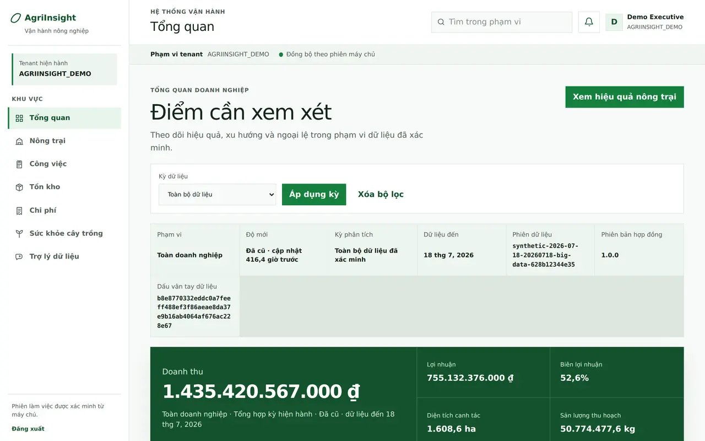

> **Portfolio / pre-production reference implementation.** AgriInsight chạy
> local và trong hosted CI; repository không tuyên bố đang phục vụ người dùng
> production, có dữ liệu nông trại thật hay có SLA mô hình.

AgriInsight là nền tảng vận hành và phân tích cho doanh nghiệp nông nghiệp. Hệ
thống kết hợp pipeline Bronze/Silver/Gold có lineage, backend tenant-scoped,
giao diện web permission-driven và lớp trợ lý dựa trên bằng chứng. Mục tiêu của
repo là cho thấy một sản phẩm có thể kiểm chứng từ dữ liệu nguồn đến quyết định,
không chỉ là một dashboard trình diễn.

## Kiến trúc

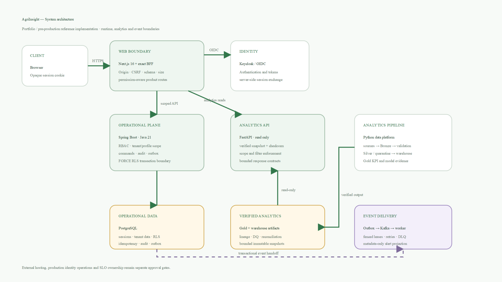

- **Python analytics:** dữ liệu nguồn → Bronze → validation/quarantine → Silver
  → warehouse/Gold, kèm checksum, reconciliation và data-quality evidence.
- **Spring Boot:** OIDC, RBAC, tenant/profile scope, PostgreSQL FORCE RLS,
  idempotent commands, audit và transactional outbox.
- **Next.js BFF:** session cookie opaque, exact-operation allowlist, kiểm tra
  origin/CSRF/schema/size và không lưu bearer token trong browser.
- **FastAPI:** read-only trên snapshot đã xác minh; scope/filter được kiểm tra
  lại, response được giới hạn và UI không tự tính lại KPI hay forecast.
- **Kafka worker:** nhận event từ outbox theo fenced lease/retry/DLQ và tạo read
  model cảnh báo metadata-only.

Chi tiết và sơ đồ trust boundary: [System Architecture](docs/system-architecture.md).

## Phạm vi sản phẩm

| Khu vực | Khả năng chính |
|---|---|
| Overview & Farms | KPI doanh nghiệp, hiệu quả trang trại, mùa vụ và yield evidence |
| Work Operations | Phân công, nhật ký append-only, correction lineage và trạng thái retry |
| Inventory | Tồn kho, lot/ledger, FEFO, ABC, days-of-supply và demand forecast evidence |
| Cost Analysis | Operating-cost ledger, procurement lens, bounded filters và export |
| Crop Health | Quan sát sâu bệnh, evidence boundary và cảnh báo ảnh demo rõ nguồn |
| Data Quality | Completeness, validity, uniqueness, freshness, quarantine và lineage |
| Assistant | RAG trên Gold đã scope, citation bắt buộc và từ chối khi thiếu bằng chứng |
| Administration | User, role, farm/warehouse assignment và audit trail theo quyền |

Hai baseline dự báo được tách khỏi landing page để tránh biến bảng evidence
cuộn ngang thành “ảnh hero”: [inventory demand forecasting](docs/system-architecture.md#web-platform)
và [yield forecasting](docs/system-architecture.md#web-platform).

## Bằng chứng giao diện

`docs/assets/screens/` chứa 14 ảnh WebP desktop/mobile được capture từ real
integration stack trong hosted CI. `catalog.json` giữ commit, run URL, viewport,
kích thước, byte size và SHA-256. Đây là demo evidence, không phải telemetry hay
dữ liệu khách hàng.

<details>
<summary><strong>Xem gallery 7 khu vực desktop/mobile</strong></summary>

**Overview**
 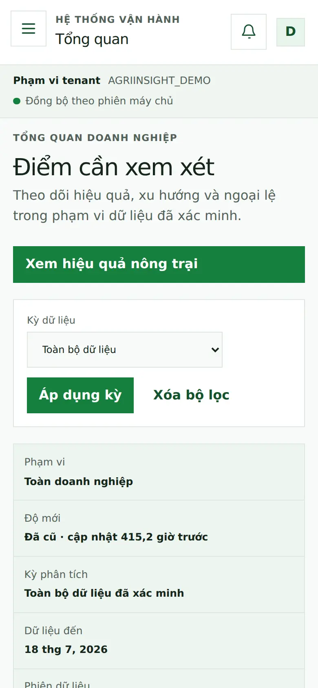

**Work Operations**
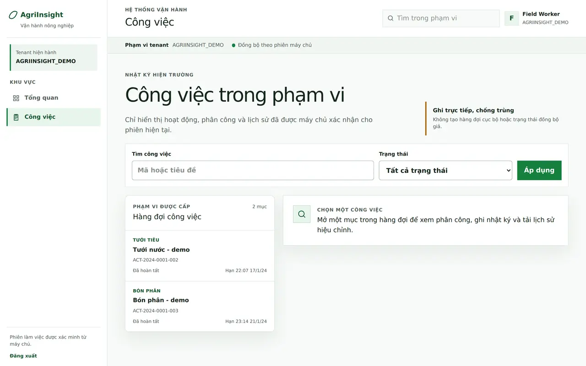 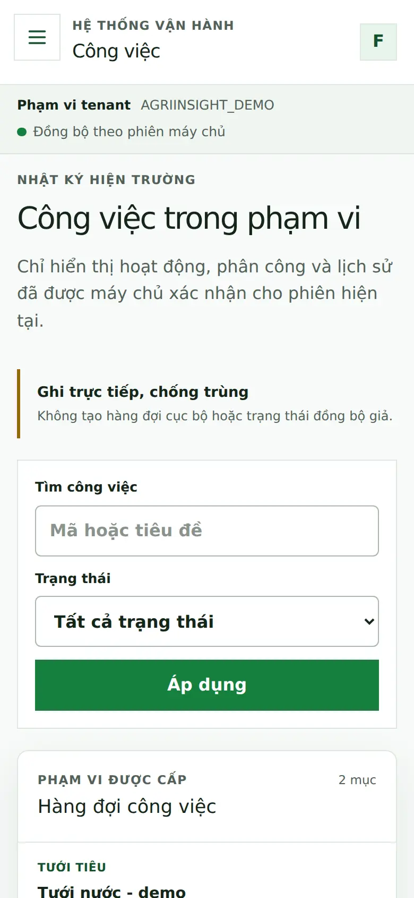

**Cost Analysis**
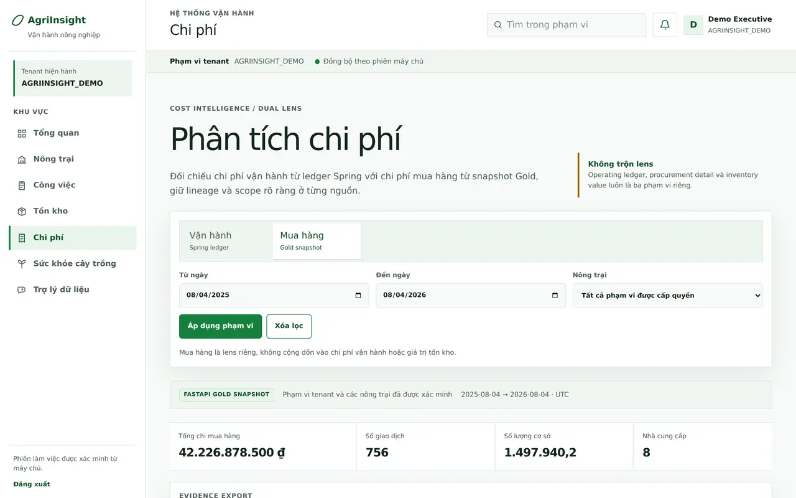 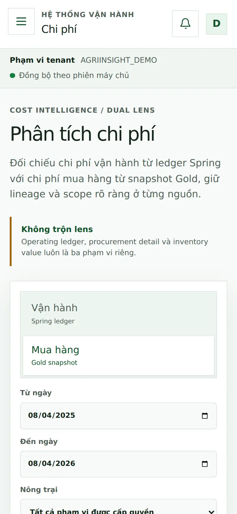

**Crop Health**
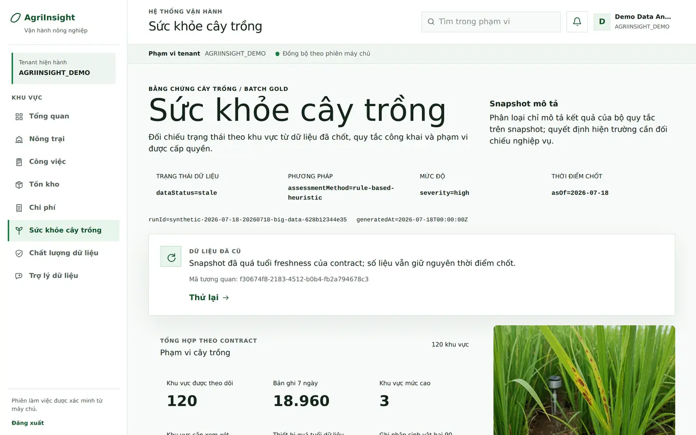 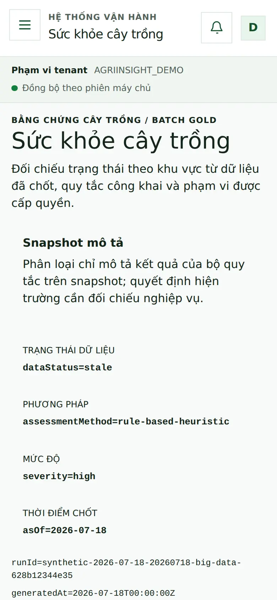

**Data Quality**
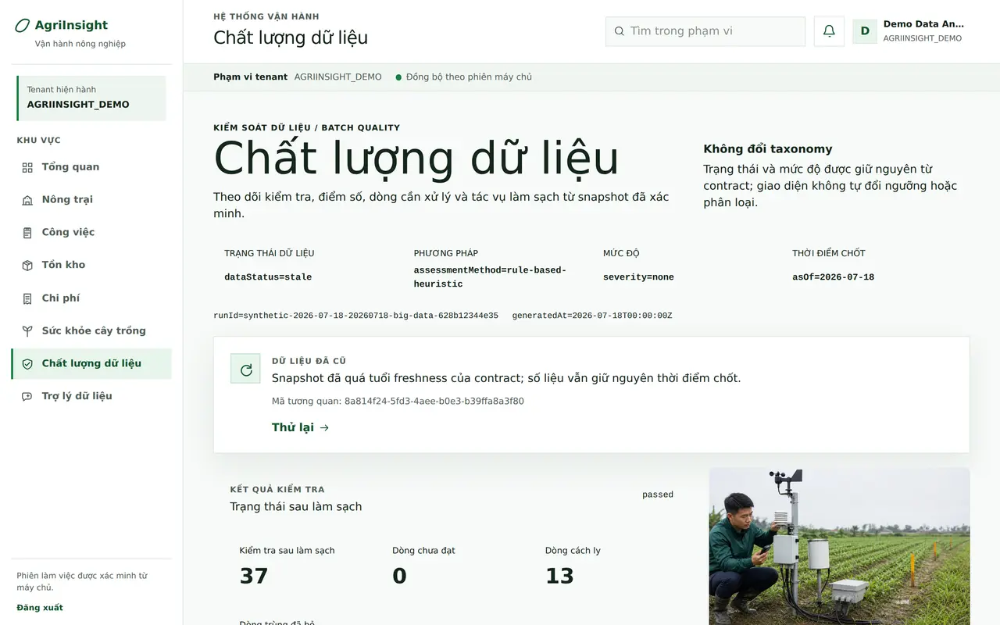 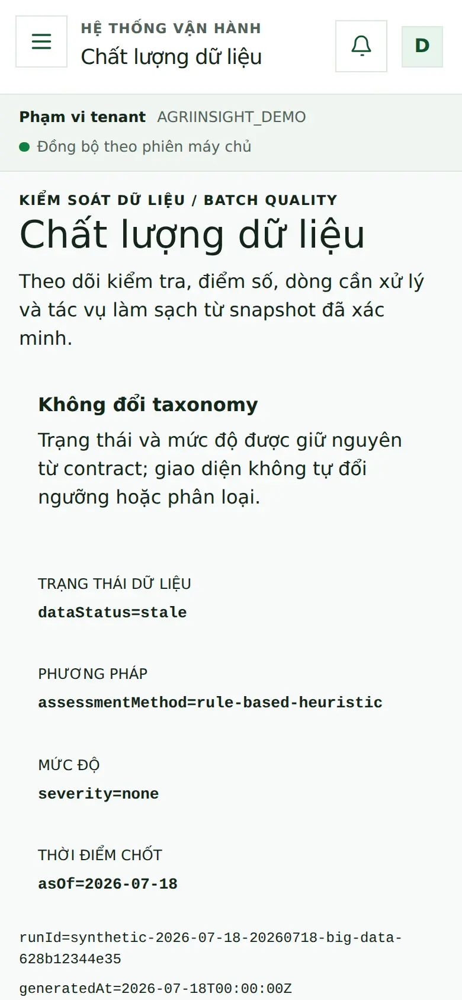

**Assistant**
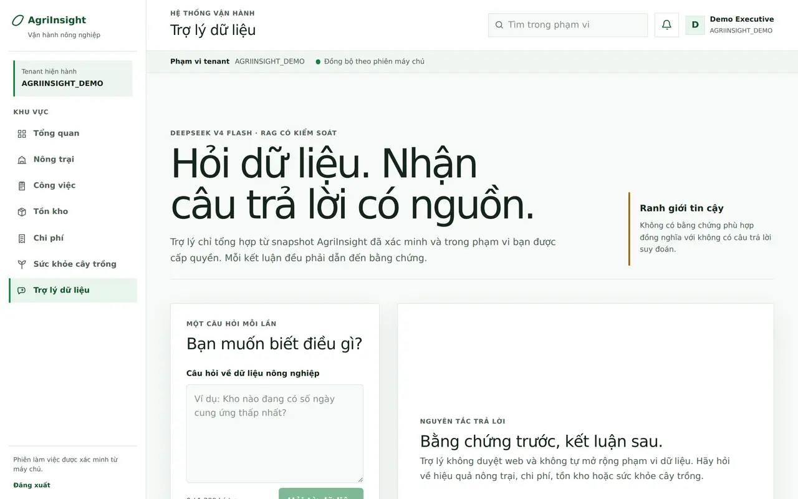 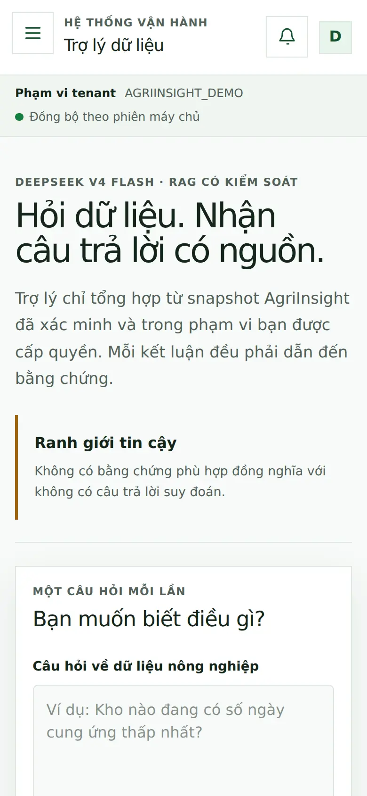

**Tenant Administration**
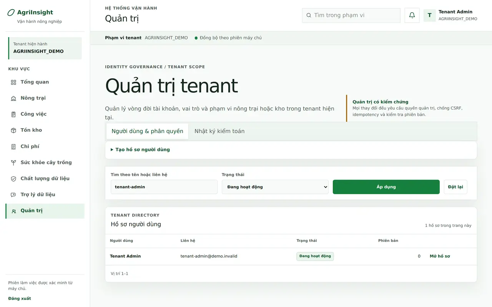 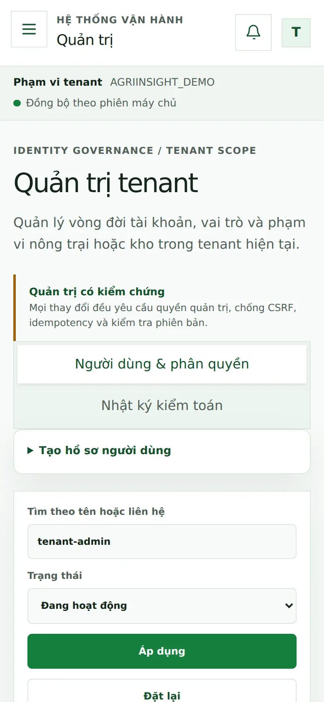

</details>

Ảnh minh họa ngữ cảnh AI được cách ly tại
[`dashboard/assets/generated/`](dashboard/assets/generated/README.md), luôn có
nhãn demo và không được dùng làm product screenshot hay bằng chứng nông học.

## Chạy local nhanh

Yêu cầu Python 3.11–3.14. Luồng nhẹ nhất tạo artifact và mở Streamlit:

```powershell
python -m pip install -e ".[dev,dashboard,reports]"
python -m agriinsight run --output artifacts
streamlit run dashboard/app.py
```

Dashboard mở tại `http://localhost:8501`. Đây là công cụ local/internal, không
có OIDC/RBAC; không expose cổng 8501 ra Internet.

Với Docker Desktop:

```powershell
docker compose up --build pipeline
docker compose up --build dashboard
```

Compose chỉ bind dashboard tại `127.0.0.1:8501`. Full platform dùng Keycloak,
PostgreSQL, Spring, FastAPI và Next.js có bootstrap riêng; làm theo
[Deployment Guide](docs/deployment-guide.md) thay vì tự ghép biến môi trường.

## Kiểm thử

```powershell
python -m pytest
npm --prefix web run contracts:check
npm --prefix web run typecheck
npm --prefix web run test
npm --prefix web run lint
npm --prefix web run build
docker compose -f compose.yaml config --quiet
```

Backend và browser/integration gate:

```powershell
powershell -ExecutionPolicy Bypass -File scripts/run-backend-tests.ps1 verify
powershell -ExecutionPolicy Bypass -File scripts/run-web-e2e-tests.ps1
```

Browser gate dựng real Keycloak/PostgreSQL/Spring/FastAPI/Next và chỉ tạo media
sau khi các journey chính đã pass.

## Cấu trúc repository

```text
src/agriinsight/   Python pipeline, metrics, reports and analytics API
dashboard/         Local Streamlit analytics workspace
backend/           Java 21 / Spring Boot operational platform
web/               Next.js 16 product UI and exact BFF
deploy/            Digest-pinned release/demo overlays
docs/              Architecture, contracts, operations and portfolio evidence
plans/             CK plans, acceptance reports and decision history
```

## Release và ranh giới production

Release `v0.4.0` có bốn first-party images cho Python, backend, web và analytics
API. Docker Hub và GHCR dùng semantic/full-SHA tags, SBOM/provenance,
candidate scan/smoke và returned-digest verification; không publish `latest`.
Registry publication là supply-chain evidence, **không phải production
deployment**.

Production vẫn là **NO-GO** cho tới khi có owner và bằng chứng thật cho hostname/TLS,
OIDC operations, secrets, observability, backup/restore, rollback và SLO. Xem
[Production Readiness](docs/production-readiness.md).

## Tài liệu

- [Documentation Hub](docs/index.md) — bản đồ tài liệu và source of truth.
- [Project Overview & PDR](docs/project-overview-pdr.md) — phạm vi, người dùng,
  yêu cầu và acceptance.
- [System Architecture](docs/system-architecture.md) — runtime, data flow và
  security boundaries.
- [Data Contracts](docs/data-contracts.md) · [Code Standards](docs/code-standards.md)
  · [Deployment Guide](docs/deployment-guide.md).
- [Project Roadmap](docs/project-roadmap.md) · [Production Readiness](docs/production-readiness.md).

## Chính sách dự án

[MIT License](LICENSE) · [Security](.github/SECURITY.md) ·
[Contributing](.github/CONTRIBUTING.md) ·
[Code of Conduct](.github/CODE_OF_CONDUCT.md)
