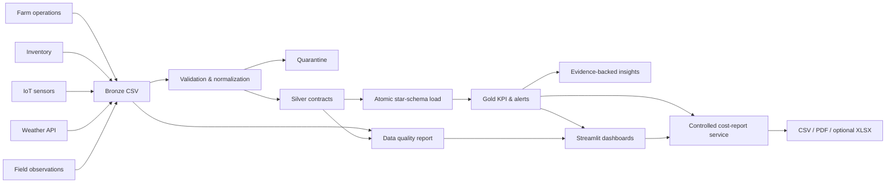

# Kiến trúc Data Analytics MVP

## Quyết định hiện tại

MVP là một modular monolith bằng Python, dùng SQLite làm analytical warehouse nhúng và Streamlit làm lớp trình diễn. Mục tiêu của phase này là ổn định ingestion contract, data-quality rules, KPI, và export contract trước khi chuyển adapter warehouse sang PostgreSQL/ClickHouse và orchestration sang Airflow/dbt.

SQLite không phải kiến trúc production cuối cùng. Nó giúp toàn bộ luồng chạy độc lập trên laptop và CI, đồng thời buộc schema vật lý, khóa ngoại, và grain của fact tables phải rõ ngay từ đầu.

## Luồng dữ liệu



## Star schema

Dimensions:

- `dim_date`
- `dim_farm`
- `dim_field`
- `dim_crop`
- `dim_season`
- `dim_activity_type`
- `dim_warehouse`
- `dim_material`
- `dim_supplier`
- `dim_sensor`
- `dim_pest_type`

Facts:

- `fact_crop_activity`: vật tư, giờ lao động và chi phí chăm sóc.
- `fact_harvest`: sản lượng, hao hụt, chất lượng và doanh thu.
- `fact_inventory_transaction`: giao dịch nhập/xuất theo SKU-location và đơn vị cơ sở.
- `fact_sensor_reading`: nhiệt độ, độ ẩm, pH, mưa và pin theo timestamp.
- `fact_weather_daily`: thời tiết theo trang trại/ngày.
- `fact_crop_health_observation`: sâu bệnh, diện tích ảnh hưởng và tỷ lệ cây chết.

Các aggregate doanh thu, chi phí và inventory movement được tính riêng trước khi join để tránh fan-out làm nhân đôi số liệu.

## Module boundaries

```text
synthetic.py
├── synthetic_inventory.py
└── synthetic_crop_health.py

transform.py
├── transform_inventory.py
└── transform_crop_health.py

metrics.py
├── metrics_inventory.py
├── metrics_crop_health.py
├── metrics_cost_analysis.py
├── metrics_cost_procurement.py
├── cost_operating_dashboard.py
└── cost_procurement_dashboard.py

dashboard/app.py
├── cost_analysis_page.py
├── cost_analysis_forms.py
├── cost_analysis_presenters.py
├── cost_procurement_presenter.py
├── cost_analysis_session.py
└── cost_analysis_snapshot.py
```

Core pipeline điều phối các domain, còn logic sinh dữ liệu, cleaning và KPI chuyên biệt nằm trong module riêng. Việc này cho phép thay nguồn giả lập bằng connector thật mà không đổi Gold contract, dashboard, hoặc export service.

Cost Analysis pre-aggregate `fact_crop_activity` và `fact_harvest` độc lập tại grain tháng/trang trại/mùa vụ trước khi join. Procurement chỉ đọc giao dịch kho `IN` trong module riêng. Giá trị tồn kho tiếp tục do `metrics_inventory.py` tính; không measure nào trong ba nhóm được nhập chung thành một “total cost”.

## Controlled cost-report export

- Service xuất báo cáo đọc Gold đã validate; formatting nằm ngoài Streamlit.
- Request chỉ nhận allowlist `scope`, `farm`, `crop`, `season`, `activity`, `supplier`, `month_from`, `month_to`, `top_n`.
- `season` chỉ hợp lệ với `scope=operating`; `scope=procurement` không nhận crop/season/activity; `scope=all` chỉ nhận farm/month.
- Reject unknown key/value, path-like value, month sai format/không tồn tại, month đảo chiều, result rỗng, hoặc detail rows quá 25,000.
- Output tách operating cost, procurement spend và inventory value; không có combined total.
- CSV dùng UTF-8 BOM; filename và hash deterministic, safe, và mỗi dòng mang `export_version`, `run_id`, `as_of_date`, `source_pipeline`, `filter_hash`.
- PDF là A4 landscape tiếng Việt, dùng Noto Sans/OFL đóng gói, có filters, run ID, top-N, footer, page numbers, và checks.
- XLSX chỉ mở khi có hai biến môi trường explicit cho Node executable và node_modules path; workbook dùng `@oai/artifact-tool`, có đúng 6 sheet, formula checks, native chart, scan lỗi/formula và `MODEL STATUS: PASS`.
- Bundle CSV/PDF cần cài Python `reports` extra; lỗi capability XLSX không làm mất hai output này.
- Temp export chỉ dùng trong caller-provided directory dưới `artifacts/_tmp` (dashboard dùng `artifacts/_tmp/cost-reports`); child temp phải xóa khi success lẫn failure và không tính vào manifest checksum.

## Cost Analysis UI boundary

- `dashboard/app.py` chỉ composition: navigation, versioned artifact loading, kiểm tra đủ 9 Cost Gold CSV + `manifest.json`, rồi gọi page module. Thiếu Cost artifact chỉ chặn route Cost Analysis; năm route cũ vẫn dùng được.
- Hai form operating/procurement dùng session key riêng. Thay filter chưa submit không sinh export; submit mới validate request và thay bundle cũ.
- Snapshot loader đọc manifest trước/sau, hash và parse cùng bytes của 9 Cost Gold CSV, so checksum thực tế và retry một lần khi manifest chuyển generation.
- Bundle bị loại khi checksum fingerprint, manifest run/date/pipeline hoặc normalized request không còn khớp, tránh tải nhầm report sau khi pipeline tái sinh artifact.
- Presentation chỉ format dữ liệu. Aggregate theo filter nằm trong domain view model; budget variance, cost/ha và cost/kg lấy ngữ cảnh Gold mùa vụ khi filter activity/month không có allocation tương ứng.
- Procurement driver giữ farm/supplier/warehouse/material business code cùng tên, không group theo display name; bảng transaction giữ định danh để audit.
- CSV/PDF luôn là baseline khi `reports` extra có mặt. XLSX unavailable dùng thông báo UI ổn định; chi tiết runtime chỉ ở server log và không làm mất hai format baseline.

## Nguyên tắc vận hành

- Bronze không bị sửa tại chỗ.
- Chỉ chuẩn hóa khi phép sửa là xác định; trường hợp không chắc chắn được quarantine.
- Mọi business key được canonicalize trước khi kiểm tra quan hệ.
- Đơn vị vật tư được đổi về đơn vị cơ sở của SKU; số lượng và đơn giá được đổi đồng thời.
- Silver phải đạt quality gate trước khi warehouse load bắt đầu.
- Warehouse được dựng vào file tạm, chạy `foreign_key_check`, commit rồi mới atomic replace.
- Seed và ngày chốt dữ liệu là một phần của run identity.
- Gold datasets là data contract của UI và export service; dashboard chỉ lọc và trực quan hóa.
- `scripts/check-workspace-disk.ps1` chỉ đọc C/D: warn dưới 10/25 GB, fail non-zero dưới 8/20 GB hoặc khi không đọc được drive; script không cleanup hay xóa dữ liệu.

## Ranh giới operational backend

Backend Java 21/Spring Boot là một Maven project riêng trong `backend/`. Analytics ghi artifact; backend ghi operational state vào PostgreSQL/Flyway. Hai plane không được âm thầm mutate dữ liệu của nhau.

Phase 1-6 đã được nghiệm thu bằng unit/HTTP/security/module test, PostgreSQL 18/Flyway integration, analytics regression và local image smoke. Phase 7 core đã có evidence transactional outbox và delivery hardening, nhưng protected production release/recovery approvals vẫn mở:

- application bootstrap và module boundary,
- security deny-by-default; chỉ exact health allowlist được public,
- JWT kiểm tra signature/algorithm, issuer, API audience, `exp`, `nbf`, subject và access-token discriminator,
- exact `(issuer, subject)` bootstrap sang profile/tenant active, sau đó nạp role/permission dưới tenant context; JWT role/tenant claim không cấp row scope,
- `/api/v1/me` và các route quản trị tenant dùng exact method/template + permission; route chưa đăng ký bị deny,
- runtime database role tách khỏi migration/identity-definer role, không phải owner/superuser/`BYPASSRLS`,
- `@TenantScoped` đặt `app.tenant_id` transaction-local trước data access; PostgreSQL `ENABLE/FORCE RLS` chặn cross-tenant read/write và pooled-connection leakage,
- mutation quản trị dùng canonical idempotency bound theo tenant/principal/route; last-admin invariant, optimistic version và authorization-denial audit được giữ trong transaction ordering đã kiểm thử,
- correlation ID, Problem Detail và security audit không lộ token/provider diagnostics,
- liveness chỉ phản ánh process; readiness gồm database và Flyway schema history,
- Flyway V1-V19 cùng repeatable helpers/grants tạo tenant anchor, identity/RBAC, tenant audit/idempotency, farm/workforce/activity/harvest/inventory/cost schema, transactional outbox và lifecycle guards,
- `integration` module owns the transactional outbox writer/drain/store boundary,
- activity/assignment/log/harvest API áp dụng manager/worker scope, bounded pagination, immutable correction lineage và KG/TONNE normalization,
- local default bind `127.0.0.1`; image chạy non-root `10001:10001`.
- hosted CI run `29932250984` xanh 5/5; backend Temurin 21.0.11 JRE Noble
  được pin digest và Trivy 0.70.0 báo zero HIGH/CRITICAL.

| Plane | Storage owner | Không được ghi |
|---|---|---|
| Analytics | `artifacts/`, Gold CSV, SQLite warehouse | PostgreSQL operational state |
| Backend | PostgreSQL + Flyway | `artifacts/`, manifest, Gold CSV, SQLite warehouse |

### Inventory operational lens

Phase 5 keeps the operational inventory ledger in PostgreSQL: warehouses, materials, suppliers, and profile-to-warehouse assignments feed immutable transactions; receipts create lots, issues allocate lots by deterministic FEFO, and balances are projections reconciled from signed ledger effects. Reversals are linked, bounded, and service-generated. V15 binds tenant and profile context transaction-locally and separates read/write RLS by role and assignment. This plane does not mutate the Python Gold inventory contract or write `artifacts/`.

Phase 5 đã đóng inventory/procurement boundary: PostgreSQL ledger, lots, allocations, balances, reversals, warehouse assignments, role-aware RLS và OpenAPI examples. Phase 6 đã đóng operating-cost boundary bằng ledger V16-V17, correction lineage, bounded summaries và role/farm-aware RLS. Phase 7 thêm V18-V19 outbox, event schema v1, role `agriinsight_integration`, fenced internal drain, image hardening, optional Compose overlay, CI scan/build và protected registry workflow. Docker Hub/GHCR phase tags cùng trỏ tới backend digest `sha256:2fb346c3b85f03022866e74ae321a8a952b224fc23e43cb0560a440730019a5d`. Backend inventory/cost vẫn tách khỏi SQLite/Gold; procurement spend, inventory value và operating cost không gộp. Identity mặc định vẫn tắt cho đến khi deployment cung cấp đầy đủ OIDC contract. Phase digest chỉ là non-production evidence; production approval remains open.

Outbox write nằm trong transaction của command record; event envelope được serialize trước commit và rollback-safe. Drain không phải broker: không có scheduler, consumer hay public route. Aggregate version là ordering key; `occurred_at` chỉ là metadata. Chi tiết role/lease/schema nằm ở [backend-development.md](backend-development.md), còn Compose, image, backup/restore và production approval nằm ở [backend-deployment.md](backend-deployment.md).

## Đường mở rộng

1. Hoàn tất backend Java/Spring Boot, authentication và row-level authorization theo các phase đã lập kế hoạch.
2. Chuyển warehouse adapter sang PostgreSQL/ClickHouse cùng migration có version.
3. Thêm incremental load, dbt tests, Airflow observability và source freshness SLA.
4. Phát sự kiện IoT/inventory qua Kafka và xử lý cảnh báo realtime.
5. Version feature sets cho dự báo sản lượng, nhu cầu kho và sâu bệnh.
6. Thêm AI Assistant Text-to-SQL chỉ đọc, allowlist schema, timeout và audit log.
