# Visual Media Gallery

AgriInsight có nhiều loại media với boundary khác nhau. Trang này gom các
asset để portfolio dễ xem nhưng không đánh đồng artwork, UI screenshot và
analytics evidence.

## Media inventory

| Nhóm | Số lượng | Nguồn | Boundary |
|---|---:|---|---|
| Hosted product UI | 14 WebP | Real seven-persona browser gate | UI evidence, không phải production telemetry |
| Product tours | 2 GIF | Derived from the verified hosted catalog | UI preview; same evidence boundary as source stills |
| Forecast evidence | 3 WebP + 2 GIF | Hosted Keycloak/PostgreSQL/Spring/FastAPI/Next gate | Verified documentation/demo evidence |
| Contextual visuals | 8 WebP + 1 GIF | First-party generated demo artwork | Marketing/context only |
| Architecture/security | 8 SVG/PNG | Repository source diagrams | Technical explanation |

## Hosted product UI

Đây là 14 ảnh desktop/mobile được capture từ real integration stack. Provenance
đầy đủ nằm trong [`screens/catalog.json`](assets/screens/catalog.json), còn
quy trình import được mô tả tại [`screens/README.md`](assets/screens/README.md).

<strong>Overview, Work và Cost</strong>

### Overview

 

### Work Operations

 

### Cost Analysis

 

<strong>Crop Health, Data Quality, Assistant và Administration</strong>

### Crop Health

 

### Data Quality

 

### Assistant

 

### Tenant Administration

 

## Verified product tours

Hai tour dưới đây được tạo lại bằng
[`scripts/build-portfolio-tour-gifs.ps1`](../scripts/build-portfolio-tour-gifs.ps1)
trực tiếp từ 14 WebP đã khớp SHA-256 trong hosted catalog. Không có mockup,
frame tự vẽ hoặc dữ liệu khách hàng được thêm vào GIF.

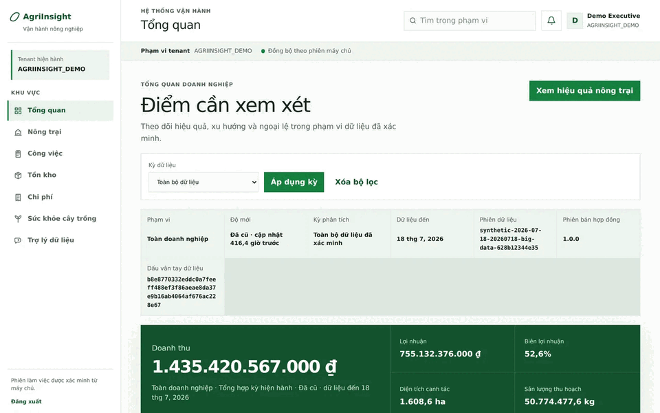 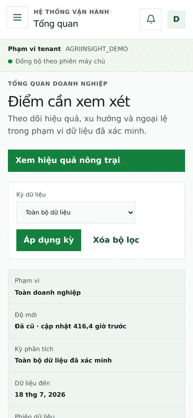

Mỗi tour có 7 frame theo thứ tự Overview, Work, Cost, Crop Health, Data Quality,
Assistant và Administration. Desktop là 960×600; mobile là 390×844.

## Forecast evidence and motion previews

Forecast media stays separate from the general UI catalog because its evidence
contract, run provenance and interpretation boundary are different.

### Inventory demand forecast

The still and GIF are paired evidence from the accepted inventory forecast
hosted gate. Details, hashes and non-production boundary:
[`assets/generated/README.md`](../assets/generated/README.md#inventory-demand-forecast-evidence).

### Yield forecast

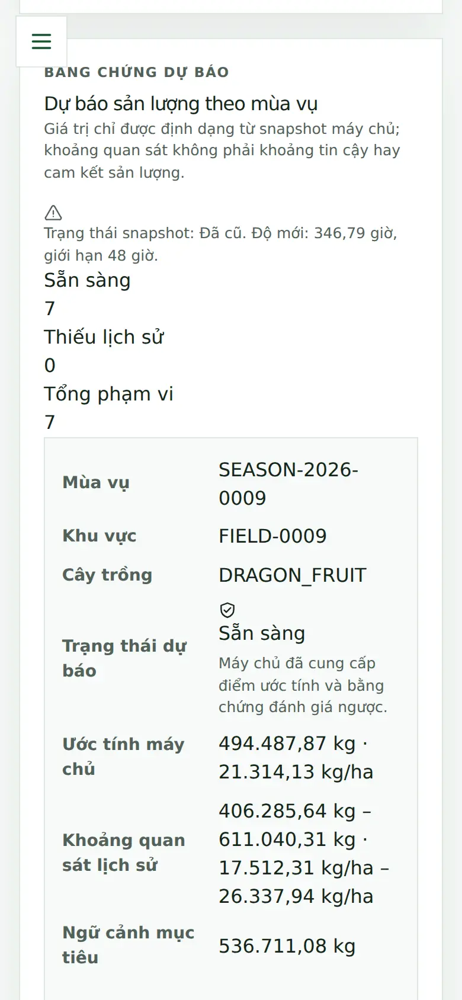

The yield stills and GIF are accepted internal decision-support evidence, not
agronomic ground truth, model accuracy/SLA, or external operational approval.

### Field-ledger contextual loop

This is a first-party contextual demo loop derived from the reviewed field
scene. It is not a real field observation and is intentionally separated from
the hosted product screenshot catalog.

## Contextual visual system

These eight WebP assets are intentionally labeled artwork for product context.
They are useful for the project narrative, but they must never be cited as UI
behavior, agronomic data, or production evidence.

<strong>Open contextual visuals</strong>

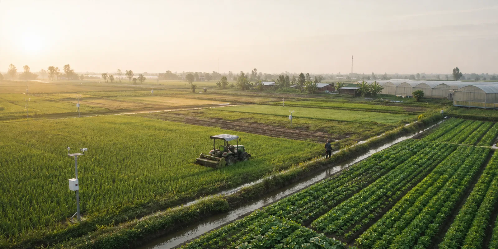 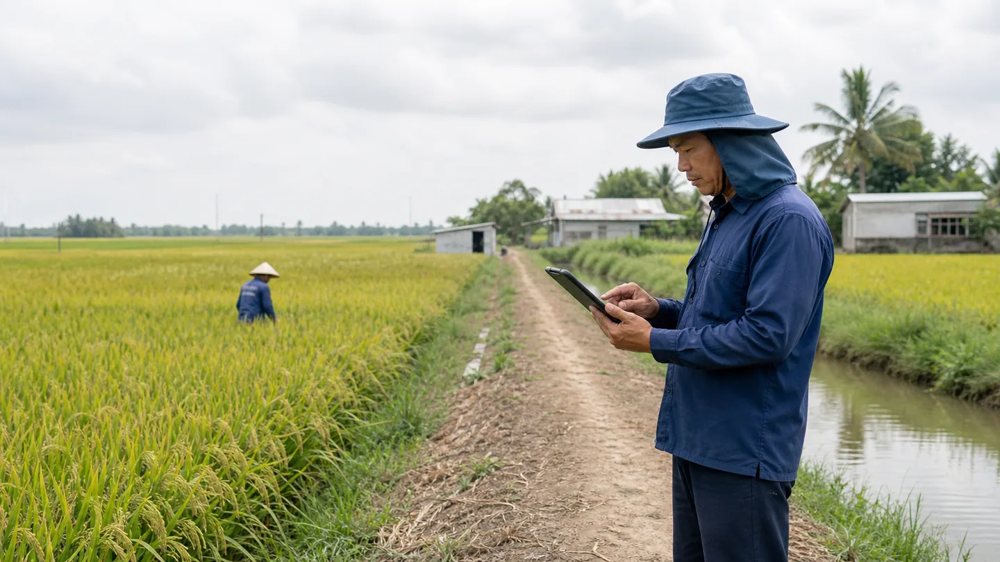 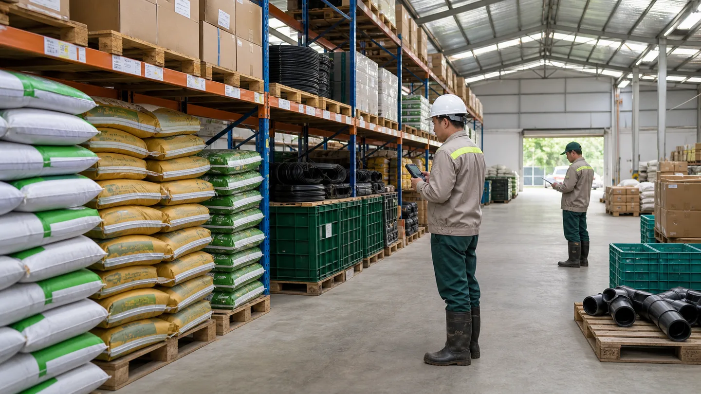 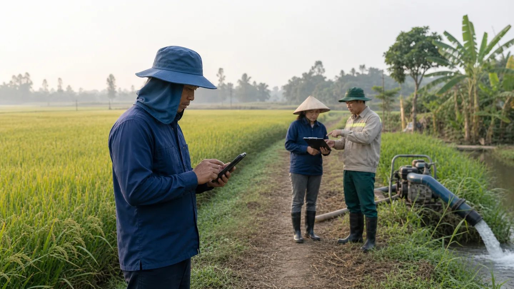

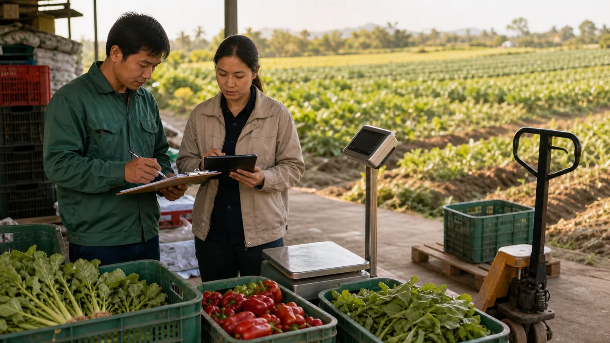 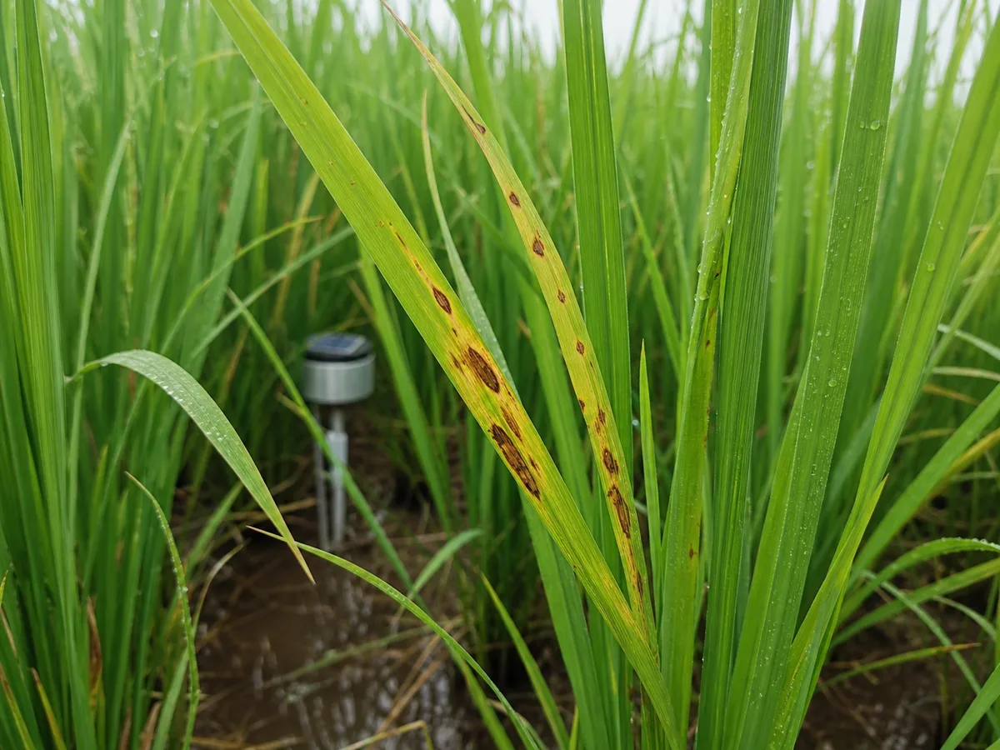 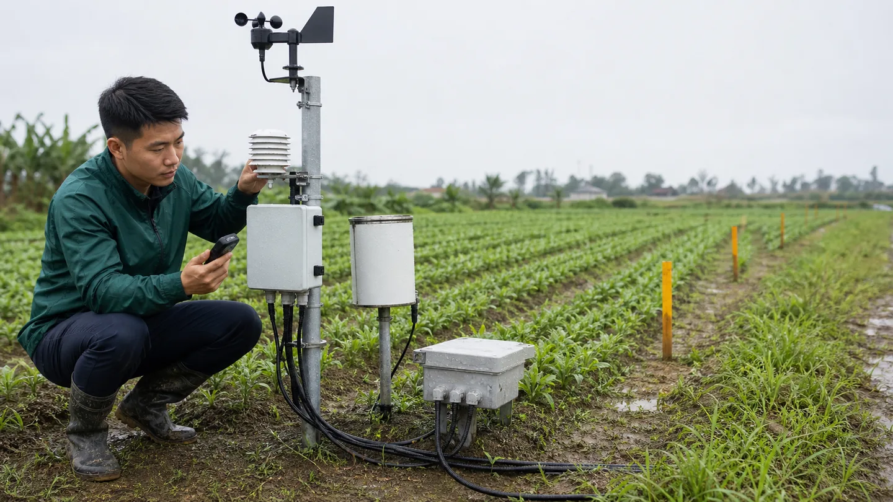 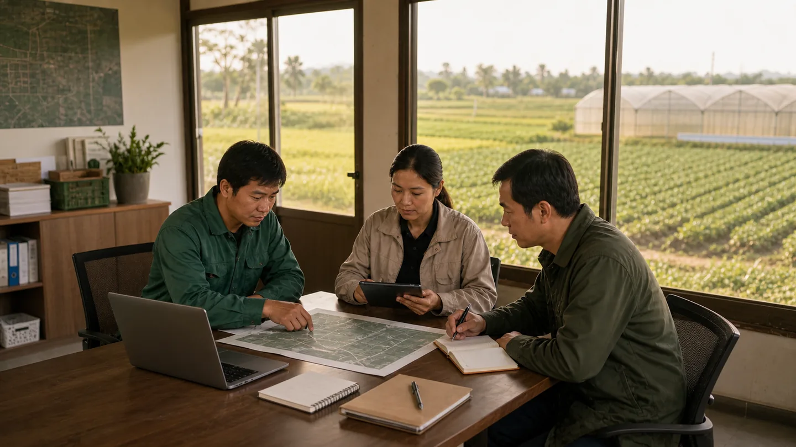

Full source and labeling policy: [`dashboard/assets/generated/README.md`](../dashboard/assets/generated/README.md).

## Architecture and trust diagrams

 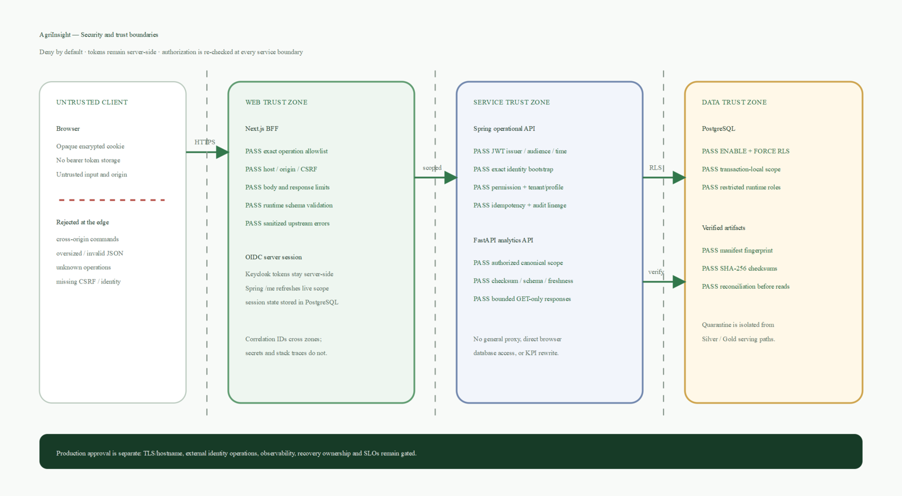

Forecast-specific delivery diagrams are maintained beside the canonical system
source: [inventory demand architecture](assets/inventory-demand-forecast-architecture.png)
and [yield forecast architecture](assets/yield-forecast-architecture.png).

## Maintenance rules

- Keep hosted UI screenshots tied to `catalog.json` and a passing CI artifact.
- Keep GIFs paired with their source stills, run URL, hash and boundary note.
- Keep contextual artwork out of product claims and agronomic conclusions.
- Review media at README width before merging; broken framing blocks publication.
