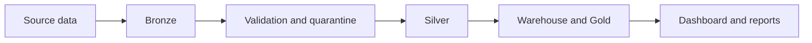
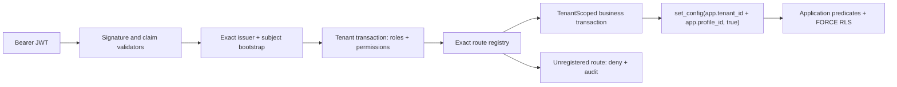

# System Architecture

AgriInsight is split into two planes.

## Contents

- [Analytics plane](#analytics-plane) - current Bronze/Silver/Gold pipeline, artifacts, and dashboard.
- [Operational backend](#operational-backend) - separate Java Spring boundary for operational state.
- [Boundaries](#boundaries) - what each plane owns and what it must not touch.
- [Current status](#current-status) - what is verified today and what is still blocked.

## Analytics plane

The analytics plane is the current validated MVP.

- Python pipeline generates Bronze, Silver, quarantine, warehouse, Gold, and manifest artifacts.
- Streamlit reads Gold contracts and renders operational views for the analytics MVP.
- Reporting is derived from normalized Gold inputs and stays local/internal.

## Operational backend

The backend is a separate Java 21 Spring Boot project under `backend/`.

Verified foundation, identity, and tenant-authorization boundary currently present in source:

- Java 21/Spring Boot application and Spring Modulith boundary
- deny-by-default stateless OAuth2 resource server
- issuer, audience, signature/algorithm, time, subject, and access-token discriminator validation
- exact `(issuer, subject)` bootstrap to active profile and tenant
- database-backed role/permission enrichment before route authorization
- exact route registry and tenant-administration APIs for users, external identities, role assignments, and farms
- one `@TenantScoped` business transaction that binds `app.tenant_id` and, for warehouse-scoped work, `app.profile_id` before repository access
- restricted runtime/migration/identity-definer PostgreSQL roles and `ENABLE/FORCE ROW LEVEL SECURITY`
- fixed-size canonical command records for tenant/principal/route-bound idempotency
- durable role, user, identity, conflict, and authorization-denial audit events
- correlation IDs and redacted `application/problem+json` responses
- liveness/readiness split and Flyway V1-V17 migrations, including serialized Field/Crop/Season, Employee, farm-assignment, activity-season, inventory-assignment, and operating-cost lifecycle guards

The request never accepts tenant scope from a header, path, or JWT tenant claim. The exact identity bootstrap is the only pre-tenant database operation. `TenantPrincipalLoader` then opens a short transaction, binds the database-verified tenant, loads the active profile plus fixed roles/permissions, closes that transaction, and only then lets Spring evaluate the exact route registry.

Every operational service entry point owns a separate `@TenantScoped` transaction. Its outer aspect binds the same tenant and authenticated profile with transaction-local `set_config` before any repository query. Missing or mismatched context fails closed, and the restricted runtime role remains subject to both application predicates and PostgreSQL FORCE RLS.

Authorization denial audit follows a deliberate ordering invariant: the rejected business transaction rolls back and releases its connection first; only then may an independent audit transaction bind the tenant and persist the denial. This prevents pool exhaustion/deadlock when the pool has one connection. Audit persistence failure keeps the client response at a generic 403 and emits only a redacted operational error type.

Mutation routes authorize before claiming an idempotency key. The command store binds a SHA-256 key digest and canonical request hash to tenant, principal, method, and route template. It stores no request body, raw key, token, or response snapshot; committed replay reconstructs a currently authorized representation.

The farm/field/crop/season master-data slice uses the same boundary for assignment-aware reads and mutations. FARM-scoped writes lock active assignments until commit; tenant-wide administrator writes remain available where the permission matrix allows them. Lifecycle transactions explicitly use READ_COMMITTED; parent deactivation and live-child inserts/updates lock the farm row in a consistent order. V7/V8 preflight fails closed on inconsistent upgrade data, and rollback preserves ENABLE/FORCE RLS.

Employee full-master access is tenant-wide, while `WORKFORCE_PICKER_READ` returns a redacted active-only projection. V9 locks active employee parents for live field/activity responsibility and blocks deactivation until dependencies close. Farm grants are append-preserved rows: revoke increments the version and never deletes/reactivates history; re-grant creates a new row. V10 locks the active profile during grant and rejects profile deactivation while an active farm assignment exists, covering both concurrency orders.

Activities use tenant, assigned-farm manager, or assigned-worker scope before paging. Task transitions and metadata updates are versioned; assignment revoke preserves history. Activity evidence is append-only, accepts bounded URI metadata without fetching it, and represents corrections as linked rows. V11 serializes live activity and season transitions. Harvest facts are also append-only, normalize KG/TONNE to kg at the API boundary, and keep correction lineage without introducing Phase 6 operating costs.

## Inventory and procurement plane

Phase 5 adds a PostgreSQL operational inventory lens without changing Python
Gold. Warehouses, materials, suppliers, and explicit profile-to-warehouse
assignments feed an append-only `inventory_transactions` ledger. Receipt rows
create `stock_lots`; issue rows allocate eligible lots deterministically by
FEFO; `stock_balances` is the warehouse/material aggregate projection. Linked
reversals restore the original direction and allocation lineage, with bounded
quantity and cumulative VND rounding rules. Reconciliation compares signed
ledger effects, allocations, lots, and balances and reports drift without
repairing source facts.

V12 creates the inventory tables, V13 adds tenant RLS, V14 serializes active
profile/warehouse assignment lifecycle, and V15 adds profile-aware,
role-aware `inventory_warehouse_access(warehouse_id, write)` policies plus
tenant-leading indexes. Reads and writes are separate policy paths: Tenant
Admin can write tenant inventory; assigned Inventory Manager can read/write;
Executive/Data Analyst can read tenant-wide; assigned Farm Manager can read;
Supplier has no inventory permission. The API registry covers warehouse,
material, supplier, assignment, balance, lot, movement, and reversal routes;
mutations require idempotency keys and strong `If-Match` where a version is
changed.

Springdoc is disabled by default. `/v3/api-docs` and Swagger UI are exposed
only when API docs are explicitly enabled in a development profile (or behind
authenticated non-development access); inventory summaries and examples are
verified by `InventoryOpenApiContractTest`.

## Operating-cost and reporting plane

Phase 6 adds an operational finance lens without changing the Python Gold
contract. `operating_cost_entries` is the single append-only source for manual
operating postings and service-generated reversals. Each row accepts one
canonical target and derives its farm/season ancestors through the parent
chain; an activity does not duplicate a season or farm total.

The API exposes bounded entry list/detail, correction, and summary routes. The
summary response labels `OPERATING_COST`, includes posting/reversal/net values,
and reports season budget variance only when grouping by season. Tenant Admin
can write; Executive/Data Analyst can read tenant-wide; assigned Farm Manager
can read assigned farms. Inventory Manager and Supplier have no cost
permission. V17 applies separate forced-RLS read/insert policies and
`operating_cost_access` resolves farm scope from the canonical target.

Operating cost, procurement spend, and inventory value are three independent
lenses. Java does not read/write SQLite, Gold, manifests, or report files, and
Phase 7's transactional outbox is the next machine-integration boundary.

## Boundaries

| Plane | Owns | Does not own |
|---|---|---|
| Analytics | artifacts, Gold contracts, local reporting, dashboard views | PostgreSQL operational state, OIDC/RBAC, backend images |
| Backend | operational API boundary, OIDC identity, tenant RBAC/RLS, tenant administration, idempotency, health, PostgreSQL schema history | `artifacts/`, Gold CSVs, SQLite warehouse, report generation |

## Current status

| Area | Status |
|---|---|
| Analytics MVP | Verified by its existing regression suite |
| Backend phase 1 foundation | Accepted 2026-07-19 |
| Backend phase 2 OIDC identity | Accepted 2026-07-20 |
| Backend phase 3 tenant RBAC/RLS | Accepted 2026-07-20; current backend regression gate remains green |
| Tenant administration | Exact user/role/farm-assignment mutation routes verified |
| Backend phase 4 operations | Accepted 2026-07-22; farm/season/workforce/activity/log/harvest gates green |
| Backend phase 5 inventory | Accepted 2026-07-22; 32 focused tests and guarded full gate green; schema V15 |
| Backend phase 6 operating cost | Accepted 2026-07-22; 26 focused tests, guarded 442/96 gate green; schema V17 |
| Backend phase 7 release boundary | Core verified 2026-07-22; V18-V19 outbox, fenced drain, images, CI, recovery wrappers; protected release/recovery approval remains |
| Docker Hub publication | Not yet claimed |
| Local backend image verification | Phase 2 non-root build/smoke verified; no registry provenance |

The right way to read the repo is: analytics and backend phases 1-6 are locally
verified. Outbox, production identity operations, and release publication
remain sequential gates, so Phase 6 acceptance is not a full
production-release claim.
