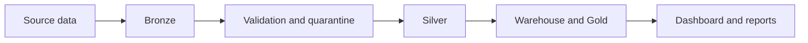
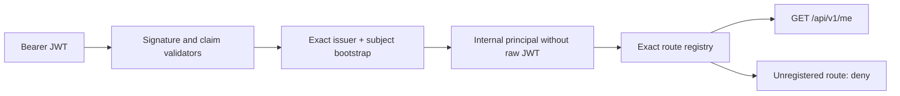

# System Architecture

AgriInsight is split into two planes.

## Contents

- [Analytics plane](#analytics-plane) - current Bronze/Silver/Gold pipeline, artifacts, and dashboard.
- [Operational backend](#operational-backend) - separate Java Spring boundary for operational state.
- [Boundaries](#boundaries) - what each plane owns and what it must not touch.
- [Current status](#current-status) - what is verified today and what is still blocked.

## Analytics plane

The analytics plane is the current validated MVP.

- Python pipeline generates Bronze, Silver, quarantine, warehouse, Gold, and manifest artifacts.
- Streamlit reads Gold contracts and renders operational views for the analytics MVP.
- Reporting is derived from normalized Gold inputs and stays local/internal.

## Operational backend

The backend is a separate Java 21 Spring Boot project under `backend/`.

Verified foundation and identity boundary currently present in source:

- Java 21/Spring Boot application and Spring Modulith boundary
- deny-by-default stateless OAuth2 resource server
- issuer, audience, signature/algorithm, time, subject, and access-token discriminator validation
- exact `(issuer, subject)` bootstrap to active profile and tenant
- exact route registry, endpoint inventory, and minimum `GET /api/v1/me` response
- correlation IDs, redacted Problem Details, and redacted authentication audit events
- liveness/readiness split and Flyway V1-V3 tenant/identity/RBAC seed migrations

The backend currently owns the verified identity boundary, not tenant permission enrichment or business CRUD. Phase 3 must install the restricted runtime role, transaction-local tenant context, effective permissions, and PostgreSQL RLS before production deployment.

## Boundaries

| Plane | Owns | Does not own |
|---|---|---|
| Analytics | artifacts, Gold contracts, local reporting, dashboard views | PostgreSQL operational state, OIDC/RBAC, backend images |
| Backend | operational API boundary, OIDC identity, health, tenant/identity schema history | `artifacts/`, Gold CSVs, SQLite warehouse, report generation |

## Current status

| Area | Status |
|---|---|
| Analytics MVP | Verified by its existing regression suite |
| Backend phase 1 foundation | Accepted 2026-07-19 |
| Backend phase 2 OIDC identity | Accepted 2026-07-20; identity disabled by default |
| Tenant RBAC/RLS | Phase 3 pending; production blocker |
| Docker Hub publication | Not yet claimed |
| Local backend image verification | Phase 2 non-root build/smoke verified; no registry provenance |

The right way to read the repo is: analytics is live today; the backend identity boundary is locally verified; tenant authorization, business APIs, and release publication remain sequential gates. Do not collapse those claims in docs or status reports.
