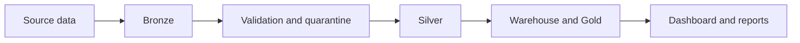
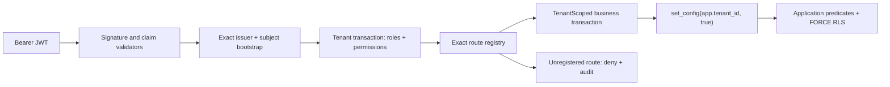

# System Architecture

AgriInsight is split into two planes.

## Contents

- [Analytics plane](#analytics-plane) - current Bronze/Silver/Gold pipeline, artifacts, and dashboard.
- [Operational backend](#operational-backend) - separate Java Spring boundary for operational state.
- [Boundaries](#boundaries) - what each plane owns and what it must not touch.
- [Current status](#current-status) - what is verified today and what is still blocked.

## Analytics plane

The analytics plane is the current validated MVP.

- Python pipeline generates Bronze, Silver, quarantine, warehouse, Gold, and manifest artifacts.
- Streamlit reads Gold contracts and renders operational views for the analytics MVP.
- Reporting is derived from normalized Gold inputs and stays local/internal.

## Operational backend

The backend is a separate Java 21 Spring Boot project under `backend/`.

Verified foundation, identity, and tenant-authorization boundary currently present in source:

- Java 21/Spring Boot application and Spring Modulith boundary
- deny-by-default stateless OAuth2 resource server
- issuer, audience, signature/algorithm, time, subject, and access-token discriminator validation
- exact `(issuer, subject)` bootstrap to active profile and tenant
- database-backed role/permission enrichment before route authorization
- exact route registry and tenant-administration APIs for users, external identities, and role assignments
- one `@TenantScoped` business transaction that binds `app.tenant_id` before repository access
- restricted runtime/migration/identity-definer PostgreSQL roles and `ENABLE/FORCE ROW LEVEL SECURITY`
- fixed-size canonical command records for tenant/principal/route-bound idempotency
- durable role, user, identity, conflict, and authorization-denial audit events
- correlation IDs and redacted `application/problem+json` responses
- liveness/readiness split and Flyway V1-V4 migrations

The request never accepts tenant scope from a header, path, or JWT tenant claim. The exact identity bootstrap is the only pre-tenant database operation. `TenantPrincipalLoader` then opens a short transaction, binds the database-verified tenant, loads the active profile plus fixed roles/permissions, closes that transaction, and only then lets Spring evaluate the exact route registry.

Every operational service entry point owns a separate `@TenantScoped` transaction. Its outer aspect binds the same tenant with transaction-local `set_config` before any repository query. Missing or mismatched context fails closed, and the restricted runtime role remains subject to both application predicates and PostgreSQL FORCE RLS.

Authorization denial audit follows a deliberate ordering invariant: the rejected business transaction rolls back and releases its connection first; only then may an independent audit transaction bind the tenant and persist the denial. This prevents pool exhaustion/deadlock when the pool has one connection. Audit persistence failure keeps the client response at a generic 403 and emits only a redacted operational error type.

Mutation routes authorize before claiming an idempotency key. The command store binds a SHA-256 key digest and canonical request hash to tenant, principal, method, and route template. It stores no request body, raw key, token, or response snapshot; committed replay reconstructs a currently authorized representation.

## Boundaries

| Plane | Owns | Does not own |
|---|---|---|
| Analytics | artifacts, Gold contracts, local reporting, dashboard views | PostgreSQL operational state, OIDC/RBAC, backend images |
| Backend | operational API boundary, OIDC identity, tenant RBAC/RLS, tenant administration, idempotency, health, PostgreSQL schema history | `artifacts/`, Gold CSVs, SQLite warehouse, report generation |

## Current status

| Area | Status |
|---|---|
| Analytics MVP | Verified by its existing regression suite |
| Backend phase 1 foundation | Accepted 2026-07-19 |
| Backend phase 2 OIDC identity | Accepted 2026-07-20 |
| Backend phase 3 tenant RBAC/RLS | Accepted 2026-07-20; 157 backend tests green |
| Tenant administration | Exact read/mutation routes verified; broader farm/work APIs remain Phase 4 |
| Docker Hub publication | Not yet claimed |
| Local backend image verification | Phase 2 non-root build/smoke verified; no registry provenance |

The right way to read the repo is: analytics is live today; backend identity plus tenant authorization are locally verified; farm/workforce, inventory, cost, outbox, and release publication remain sequential gates. Phase 3 acceptance is not a full production-release claim.
