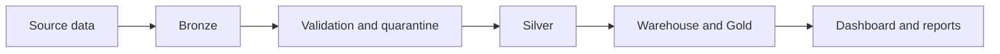
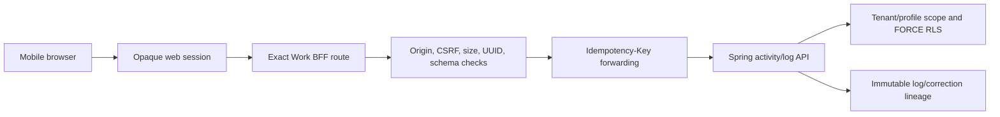
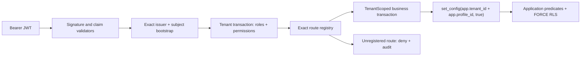

# System Architecture

AgriInsight is split into two planes.

## Contents

- [Analytics plane](#analytics-plane) - current Bronze/Silver/Gold pipeline, artifacts, and dashboard.
- [Internal analytics API](#internal-analytics-api) - read-only, Spring-gated, filter-aware analytics API and cache boundary.
- [Web platform](#web-platform) - opaque browser sessions, exact BFF operations, and accepted product routes.
- [Operational backend](#operational-backend) - separate Java Spring boundary for operational state.
- [Inventory and procurement plane](#inventory-and-procurement-plane) - PostgreSQL operational ledger and RLS.
- [Operating-cost and reporting plane](#operating-cost-and-reporting-plane) - separate finance lens and summaries.
- [Transactional outbox](#transactional-outbox) - machine-integration handoff used by the backend only.
- [Realtime operational alert center](#realtime-operational-alert-center) - metadata-only alert projection and isolated worker boundary.
- [Boundaries](#boundaries) - what each plane owns and what it must not touch.
- [Current status](#current-status) - what is verified today and what is still blocked.

## Analytics plane

The analytics plane is the current validated MVP.

- Python pipeline generates Bronze, Silver, quarantine, warehouse, Gold, and manifest artifacts.
- Streamlit reads Gold contracts and renders operational views for the analytics MVP.
- Reporting is derived from normalized Gold inputs and stays local/internal.
- The demo catalog now includes eight generated WebP visuals; they are UI
  evidence assets, not source facts.


```mermaid
flowchart LR
    A["Source data"] --> B["Bronze"]
    B --> C["Validation and quarantine"]
    C --> D["Silver"]
    D --> E["Warehouse and Gold"]
    E --> F["Dashboard and reports"]
```

## Internal analytics API

The Phase 2 FastAPI service is an internal read surface over one immutable,
checksum-verified snapshot. Its request path loads bounded Gold datasets plus
verified `gold/cost_activity_detail.csv` and `silver/harvests.csv` fact tables,
each capped at 100,000 rows, and `quality/data_quality_report.json`. Those fact
tables are used only for canonical farm, field, crop, season, and date
filtering, then server-side KPI aggregation. Raw million-row sensor and IoT
reading facts remain artifact-side and are never loaded by an HTTP request.

Authorization is split across the web BFF and FastAPI. Spring `/api/v1/me`
supplies the authenticated tenant, roles, permissions, and live farm/warehouse
catalogs. The web layer resolves UUID filters to canonical Spring codes before
calling analytics: `farmId -> farmCode`, `fieldId -> fieldCode + farmId`,
`cropId -> cropCode`, and `seasonId -> seasonCode + farmId + fieldId + cropId`.
Unknown, inactive, cross-parent, or incomplete selections fail closed before
analytics access. FastAPI then independently rejects a `farm_code` outside the
authorized scope and any requested filter combination that does not exist in the
verified `cost_season` relationship table, with scope failures returning 403 and
relationship conflicts returning 422.

The filter contract accepts only `farm_code`, `field_code`, `crop_code`,
`season_code`, and `date_preset`; bounded pagination and sorting remain separate
query controls. The date presets are `all` for the full verified snapshot,
`last-30-days` for `asOf - 29 days` through `asOf`, and `season-to-date` for the
selected season's verified `start_date` through `asOf`; the last preset requires
`season_code`. The response envelope exposes applied-filter metadata plus
lineage and freshness. The applied filter carries canonical codes and resolved
date bounds (`date_from`, `date_to`, `date_preset`) so the browser can render
labels without recomputing the range.

The process-local cache is keyed by the verified manifest fingerprint and run.
It rechecks the manifest before returning a response and rejects checksum,
schema, freshness, reconciliation, and mid-read replacement failures. A
reconciliation report is a deployment evidence artifact, not a substitute for
the per-request Spring scope checks. The service is GET-only and has no
artifact/database write path.

The explicit demo bootstrap is a separate transaction boundary. It generates
credential-free SQL under ignored D-local `_tmp`, requires a loopback target
named `agriinsight_demo`, and verifies the PostgreSQL server marker
`app.agriinsight_demo_database=true`. It imports bounded operational samples,
seven personas, and canonical masters from the verified snapshot, then writes a
report whose tenant/run/fingerprint must match the generated bundle. Deliberate
revocation or scope shrinkage fails closed rather than silently restoring an
authorization decision.

## Web platform

The Next 16 App Router is the browser boundary for eight product areas:
`/overview`, `/farms` (including `/farms/[farmId]`), `/work`, `/inventory`,
`/costs`, `/crop-health`, `/data-quality`, and `/admin`. The browser holds only
an opaque encrypted session cookie. OIDC tokens remain in the PostgreSQL-backed
server session, and the server refreshes Spring `/api/v1/me` before relying on
current permissions. Exact operation allowlists prevent the browser from
turning the BFF into a general upstream proxy.

Overview and farm routes combine Spring-scoped UUID masters with canonical
analytics codes before calling the read-only FastAPI plane. Work Operations
uses only the frozen Spring activity family. Its loader pages activity logs and
correction history in exact 50-row windows, preserves the upstream offset, and
never fetches beyond the backend offset cap of 10,000.

The two Work mutation handlers accept only append and correction POSTs. They
reject untrusted host/origin, missing session/CSRF/idempotency headers,
non-JSON or oversized payloads, invalid UUIDs, and unexpected body fields
before the upstream call. The request stream is cancelled once it exceeds
64 KiB. Upstream denial/conflict details are sanitized while correlation IDs
remain available for support. Append-only mutations do not carry `If-Match`;
same-target retries reuse their key, while activity/log navigation resets draft
and retry identity.

`/inventory` is warehouse-scoped stock control. The route gates on
`INVENTORY_READ`, sources command visibility from `INVENTORY_MANAGE`, redirects
to the first visible warehouse, and fails closed when a requested warehouse or
material sits outside session scope. Balances, lots, ledger rows, and
material/supplier catalogs come from exact Spring GET operations in 50-row
windows under the same 10,000 offset ceiling, and the browser preserves upstream
ordering: warehouse/material code order for balances, FEFO for lots, and
newest-first for the ledger. ABC classes, alerts, days of supply, and reorder
suggestions render verbatim from the FastAPI Gold envelope, so an analytics
denial or outage degrades that section alone and leaves the Spring ledger live.

Two exact inventory POST operations carry commands: a receipt/issue transaction
and a linked reversal. Both follow the Work trust-boundary order. The reversal
additionally requires a strong quoted-integer `If-Match`. The browser never
invents that version: it reads it from an authenticated transaction fetch through
the BFF. Enforcement is authoritative in the backend, which parses the header,
binds the expected version into the reversal command, and folds it into the
canonical idempotency fingerprint, so a stale or guessed version cannot apply.
A command whose outcome is unknown keeps both its `Idempotency-Key` and its
source version, so an identical retry replays the already-committed reversal
instead of appending a second ledger row.


```mermaid
flowchart LR
    U["Mobile browser"] --> S["Opaque web session"]
    S --> G["Exact Work BFF route"]
    G --> V["Origin, CSRF, size, UUID, schema checks"]
    V --> I["Idempotency-Key forwarding"]
    I --> A["Spring activity/log API"]
    A --> P["Tenant/profile scope and FORCE RLS"]
    A --> H["Immutable log/correction lineage"]
```

## Container runtime topology

Four first-party images share one serialized protected publication workflow:
Python pipeline/dashboard, Spring backend, Next web, and FastAPI analytics API.
The web and analytics images run as UID/GID `10001`, accept a read-only root
filesystem, and use explicit `/tmp` tmpfs mounts. Semantic-version and full-SHA
tags may be published to Docker Hub and GHCR only after candidate scan/smoke;
BuildKit SBOM/provenance and exact-digest scan/smoke are mandatory. `latest` is
not part of the tag model. The in-progress alert-worker hardening reuses the
backend image and does not yet have a new tag, digest, package visibility, or
external deployment.

`deploy/compose.release-overlay.yaml` replaces local builds with digest-pinned
first-party images and orders backend/web migrations before readiness. The
opt-in `deploy/compose.web-demo-overlay.yaml` layers real Keycloak, the guarded
big-data seed/reconciliation chain, seven personas, FastAPI readiness, and the
browser app. PostgreSQL and Keycloak remain pinned upstream dependencies, never
AgriInsight packages. Registry publication and production runtime approval are
separate controls; a green internal candidate does not imply production.

## Operational backend

The backend is a separate Java 21 Spring Boot project under `backend/`.

Verified foundation, identity, and tenant-authorization boundary currently present in source:

- Java 21/Spring Boot application and Spring Modulith boundary
- deny-by-default stateless OAuth2 resource server
- issuer, audience, signature/algorithm, time, subject, and access-token discriminator validation
- exact `(issuer, subject)` bootstrap to active profile and tenant
- database-backed role/permission enrichment before route authorization
- exact route registry and tenant-administration APIs for users, external identities, role assignments, and farms
- one `@TenantScoped` business transaction that binds `app.tenant_id` and, for warehouse-scoped work, `app.profile_id` before repository access
- restricted runtime/migration/identity-definer PostgreSQL roles and `ENABLE/FORCE ROW LEVEL SECURITY`
- fixed-size canonical command records for tenant/principal/route-bound idempotency
- durable role, user, identity, conflict, and authorization-denial audit events
- correlation IDs and redacted `application/problem+json` responses
- liveness/readiness split and Flyway V1-V27 migrations, including serialized Field/Crop/Season, Employee, farm-assignment, activity-season, inventory-assignment, operating-cost, transactional outbox lifecycle guards, realtime read models, tenant summary index, immutable V22 alert storage, V23 metadata/cursor hardening, and V24-V27 concurrent scan indexes; expected schema version is 27
- `integration` module for transactional outbox events, writer port, drain service, and fenced PostgreSQL store
- Phase 1 contract freeze adds eight additive bounded GET reads:
  activity assignments, activity logs, activity log correction history, user
  roles, external-identity link status, farm assignments, warehouse
  assignments, and tenant audit events.
- Deterministic OpenAPI export is frozen at 67 paths and 94 operations. Every
  operation carries `X-Correlation-Id`; 13 versioned detail GETs carry `ETag`.


```mermaid
flowchart LR
    T["Bearer JWT"] --> V["Signature and claim validators"]
    V --> I["Exact issuer + subject bootstrap"]
    I --> E["Tenant transaction: roles + permissions"]
    E --> R["Exact route registry"]
    R --> B["TenantScoped business transaction"]
    B --> C["set_config(app.tenant_id + app.profile_id, true)"]
    C --> P["Application predicates + FORCE RLS"]
    R --> D["Unregistered route: deny + audit"]
```

The request never accepts tenant scope from a header, path, or JWT tenant claim. The exact identity bootstrap is the only pre-tenant database operation. The principal-loading step then opens a short transaction, binds the database-verified tenant, loads the active profile plus fixed roles/permissions, closes that transaction, and only then lets Spring evaluate the exact route registry.

Every operational service entry point owns a separate `@TenantScoped` transaction. Its outer aspect binds the same tenant and authenticated profile with transaction-local `set_config` before any repository query. Missing or mismatched context fails closed, and the restricted runtime role remains subject to both application predicates and PostgreSQL FORCE RLS.

Authorization denial audit follows a deliberate ordering invariant: the rejected business transaction rolls back and releases its connection first; only then may an independent audit transaction bind the tenant and persist the denial. This prevents pool exhaustion/deadlock when the pool has one connection. Audit persistence failure keeps the client response at a generic 403 and emits only a redacted operational error type.

Mutation routes authorize before claiming an idempotency key. The command store binds a SHA-256 key digest and canonical request hash to tenant, principal, method, and route template. It stores no request body, raw key, token, or response snapshot; committed replay reconstructs a currently authorized representation.

The farm/field/crop/season master-data slice uses the same boundary for assignment-aware reads and mutations. FARM-scoped writes lock active assignments until commit; tenant-wide administrator writes remain available where the permission matrix allows them. Lifecycle transactions explicitly use READ_COMMITTED; parent deactivation and live-child inserts/updates lock the farm row in a consistent order. V7/V8 preflight fails closed on inconsistent upgrade data, and rollback preserves ENABLE/FORCE RLS.

Employee full-master access is tenant-wide, while `WORKFORCE_PICKER_READ` returns a redacted active-only projection. V9 locks active employee parents for live field/activity responsibility and blocks deactivation until dependencies close. Farm grants are append-preserved rows: revoke increments the version and never deletes/reactivates history; re-grant creates a new row. V10 locks the active profile during grant and rejects profile deactivation while an active farm assignment exists, covering both concurrency orders.

Activities use tenant, assigned-farm manager, or assigned-worker scope before paging. Task transitions and metadata updates are versioned; assignment revoke preserves history. Activity evidence is append-only, accepts bounded URI metadata without fetching it, and represents corrections as linked rows. V11 serializes live activity and season transitions. Harvest facts are also append-only, normalize KG/TONNE to kg at the API boundary, and keep correction lineage without introducing Phase 6 operating costs.

## Inventory and procurement plane

Phase 5 adds a PostgreSQL operational inventory lens without changing Python Gold. Warehouses, materials, suppliers, and explicit profile-to-warehouse assignments feed an append-only `inventory_transactions` ledger. Receipt rows create `stock_lots`; issue rows allocate eligible lots deterministically by FEFO; `stock_balances` is the warehouse/material aggregate projection. Linked reversals restore the original direction and allocation lineage, with bounded quantity and cumulative VND rounding rules. Reconciliation compares signed ledger effects, allocations, lots, and balances and reports drift without repairing source facts.

V12 creates the inventory tables, V13 adds tenant RLS, V14 serializes active profile/warehouse assignment lifecycle, and V15 adds profile-aware, role-aware `inventory_warehouse_access(warehouse_id, write)` policies plus tenant-leading indexes. Reads and writes are separate policy paths: Tenant Admin can write tenant inventory; assigned Inventory Manager can read/write; Executive/Data Analyst can read tenant-wide; assigned Farm Manager can read; Supplier has no inventory permission. The API registry covers warehouse, material, supplier, assignment, balance, lot, movement, and reversal routes; mutations require idempotency keys and strong `If-Match` where a version is changed.

Springdoc is disabled by default. `/v3/api-docs` and Swagger UI are exposed only when API docs are explicitly enabled in a development profile (or behind authenticated non-development access); inventory summaries and examples are verified by the inventory OpenAPI contract checks.

## Operating-cost and reporting plane

Phase 6 adds an operational finance lens without changing the Python Gold contract. `operating_cost_entries` is the single append-only source for manual operating postings and service-generated reversals. Each row accepts one canonical target and derives its farm/season ancestors through the parent chain; an activity does not duplicate a season or farm total.

The API exposes bounded entry list/detail, correction, and summary routes. The summary response labels `OPERATING_COST`, includes posting/reversal/net values, and reports season budget variance only when grouping by season. Tenant Admin can write; Executive/Data Analyst can read tenant-wide; assigned Farm Manager can read assigned farms. Inventory Manager and Supplier have no cost permission. V17 applies separate forced-RLS read/insert policies and `operating_cost_access` resolves farm scope from the canonical target.

Operating cost, procurement spend, and inventory value are three independent lenses. Java does not read/write SQLite, Gold, manifests, or report files.

## Web cost analysis plane

Web Phase 8 adds a server-rendered Next route at `/costs`. The route dispatches
only two explicit lenses: `operating` reads the Spring ledger and summaries;
`procurement` reads the scoped FastAPI Gold snapshot. The BFF validates URL
filters, checks `COST_READ`/`COST_MANAGE`, maps farm UUIDs to active canonical
codes, and validates upstream payloads with generated-contract-derived Zod
schemas. Browser code never stores bearer tokens or calls Spring/FastAPI
directly.

Commands remain append-only: posting and correction routes require same-origin
CSRF plus a stable `Idempotency-Key`, and corrections carry the original entry
identifier while the backend appends reversal/replacement rows. Export uses a
single format per request (`csv`, `pdf`, or capability-gated `xlsx`), forwards
only safe content headers, and never exposes staging paths. Procurement is
read-only and inventory value remains outside both cost lenses.

## DeepSeek RAG assistant plane

The assistant is an optional query plane over existing authorized analytics
facts, not a new source of truth and not Text-to-SQL. The request path is:

```text
Browser → same-origin Next BFF → FastAPI scope resolver
        → checksum/reconciliation gate → scoped Gold evidence corpus
        → deterministic lexical retrieval → DeepSeek V4 Flash
        → strict JSON/citation validation → plain-text UI
```

The browser submits only `question` plus at most 6 ephemeral history turns.
The BFF enforces host, origin, CSRF, opaque session, body/response limits,
timeout/cancellation, exact upstream allowlisting, and sanitized problems.
FastAPI derives tenant/farm/warehouse/source scope from Spring; it filters
before ranking and never accepts a client model, tenant, evidence, or tool.
Unsupported queries return a local insufficient-evidence response without an
LLM call.

DeepSeek receives only bounded, already-authorized evidence and an opaque
one-way tenant hash. Thinking is disabled, redirects are rejected, output must
be complete JSON, and every factual sentence must cite an evidence ID available
in the retrieval result. Truncation, undeclared markers, uncited claims, and
invalid usage accounting fail closed. A bounded provider queue plus per-process
tenant request/token reservations limits abuse and concurrent budget
oversubscription; provider-account controls remain the authoritative
cross-replica spend boundary. The UI renders answer/citations as text rather
than HTML and exposes a real request-cancellation action. Telemetry records
operational counters only and no conversation content.

## Transactional outbox

Phase 7 adds the `integration` module transactional outbox boundary. It is the
persisted handoff for machine integration. Source includes the opt-in Kafka
publisher path, tenant realtime read models, and tenant summary API. Historical
realtime runner/workflow evidence belongs to that foundation; it is not hosted
acceptance, image publication, or deployment evidence for the current
in-progress alert-worker hardening.

- `outbox_events` is committed in the same transaction as the domain command.
- `agriinsight_integration` is a NOLOGIN role used for claim/read/update fencing.
- The outbox uses at-least-once delivery, bounded leases, and dead-lettering for stale or failed work.
- Claim/ack/retry ordering is keyed by aggregate version and guarded by `(tenant_id, command_id, event_ordinal)` plus `(tenant_id, aggregate_type, aggregate_id, aggregate_version)`.
- The schema contract is versioned by `backend/src/main/resources/contracts/agriinsight-operational-events-v1.schema.json`.

## Realtime operational alert center

`V22` alert storage is immutable. The current isolated operational alert
hardening is in progress and remains metadata-only: it does not add a public
REST/API or UI alert center, and it does not define semantic agriculture alerts.
It hardens the backend worker boundary around transport-health evidence already
owned by the realtime system.

The hardening schema is V23-V27 and readiness expects 27. V23 leaves legacy
source/evidence constraints `NOT VALID`; a repeatable 500-row operator
backfill must finish with no legacy or invalid-shape rows before the worker is
enabled. V24-V27 each build one scan index concurrently; V27 is the
readiness-only partial invalid-source-evidence index and does not replace the
V23 backfill. Invalid-index recovery must follow the migration-specific
precondition rather than rerunning blindly.

- The private `realtime-alert-worker` Compose service uses the non-web
  `realtime-worker` profile and the restricted, no-inheritance
  `agriinsight_alert_worker` login. Compose requires
  `AGRIINSIGHT_DB_ALERT_WORKER_PASSWORD`; it supplies no public worker port.
- Only that alert-worker service disables the legacy Kafka publisher/consumer
  path. The existing `realtime-worker` retains the legacy path, while the alert
  DLT observer is a distinct observer path with an independent group/failure
  topic and untrusted framework headers.
- The worker can use only tenant IDs, narrow outbox/receipt metadata, alert
  projection, and cursor state. It never receives business-table access, raw
  Kafka values, outbox payloads, or error text. DLT attribution validates the
  bounded envelope, then in a dedicated transaction looks up `(tenant_id,
  event_id)` in `outbox_events`, uses the database `occurred_at`, and only
  upserts on a match; unmatched DLTs increment the unverified metric and log a
  stable event.
- Scans use durable per-policy cursors and fair pages bounded to the default
  500 candidates plus a continuation probe. `REPEATABLE_READ`, a policy-level
  advisory lock, current-condition recovery, hysteresis, and saturation
  signalling protect against overlap, stale resolution, flapping, and
  unbounded outage work. Default query time is 20 seconds and is capped by
  configuration at 60 seconds.

## Boundaries

| Plane | Owns | Does not own |
|---|---|---|
| Analytics | artifacts, Gold contracts, local reporting, dashboard views | PostgreSQL operational state, OIDC/RBAC, backend images |
| Web | opaque browser sessions, route UI, exact Spring/FastAPI BFF adapters | bearer-token storage in the browser, operational facts, analytics joins |
| Backend | operational API boundary, OIDC identity, tenant RBAC/RLS, tenant administration, idempotency, health, PostgreSQL schema history | `artifacts/`, Gold CSVs, SQLite warehouse, report generation |

## Current status

| Area | Status |
|---|---|
| Analytics MVP | Verified by its existing regression suite |
| Backend phase 1 foundation | Accepted 2026-07-19 |
| Backend phase 2 OIDC identity | Accepted 2026-07-20 |
| Backend phase 3 tenant RBAC/RLS | Accepted 2026-07-20; current backend regression gate remains green |
| Tenant administration | Exact user/role/farm-assignment mutation routes verified |
| Backend phase 4 operations | Accepted 2026-07-22; farm/season/workforce/activity/log/harvest gates green |
| Backend phase 5 inventory | Accepted 2026-07-22; 32 focused tests and guarded full gate green; schema V15 |
| Backend phase 6 operating cost | Accepted 2026-07-22; 26 focused tests, guarded 442/96 gate green; schema V17 |
| Backend phase 1 contract freeze | Verified 2026-07-23; eight additive bounded GET reads, deterministic OpenAPI export, and current 459+100 backend gate |
| Backend phase 7 release boundary | Outbox/realtime foundation has historical evidence; isolated alert-worker hardening is in progress and still needs migration, focused tests, review, merge, and protected release/recovery gates |
| Realtime alert worker | Source/Compose topology is private and non-web; no public alert API/UI, semantic agriculture policy, hosted acceptance, image publication, or external deployment is claimed |
| Disposable web auth spike | `openid-client` 6.8.4 won; Better Auth 1.6.24 rejected on executable refresh fencing; spike remains non-production |
| Production web Phase 5 | Accepted locally 2026-07-26; overview and scoped farm intelligence routes verified |
| Production web Phase 6 | Accepted locally 2026-07-26; mobile Work reads, idempotent append, append-only correction, bounded immutable history, and 6/6 real-browser gate verified |
| Hosted CI | Run `29932250984` passed Java, Python, secret/dependency, and both image scan/smoke gates 5/5 at commit `8d8463f` |
| Protected image workflow | Historical Phase 7 tags are separate evidence; any new backend image/package publication for this slice waits for migration, tests, review, merge, protected environment approval, and an exact returned digest |
| Backend runtime verification | Digest-pinned Temurin 21.0.11 JRE Noble; Trivy 0.70.0 zero HIGH/CRITICAL; UID/GID 10001 pull-by-digest smoke passed |

The right way to read the repo is: analytics and backend phases 1-6 are
accepted, Phase 1 contract freeze is verified in the checked-in OpenAPI
artifact, and Phase 7 has historical outbox/image/recovery evidence. The
isolated alert-worker hardening is a separate in-progress private slice.
Production identity configuration, protected release approval, recovery-policy
ownership, and all external promotion remain open.
