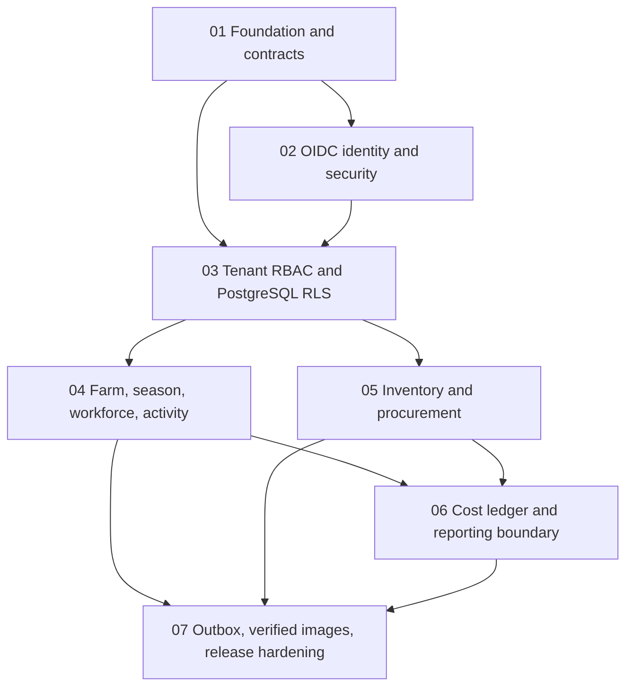

# Backend Application, Authentication and Row-Scoped Authorization

## Overview

This plan delivers Stage 2 of the AgriInsight specification: a separately deployable Java 21/Spring Boot modular monolith that owns new operational data and exposes secured REST APIs while the proven Python pipeline remains the only writer of analytical artifacts. The plan is intentionally sequential because identity, tenant context, RLS, and domain foreign keys form one security-sensitive dependency chain.

## Scope challenge

- Existing: Python 0.2.0 already owns Bronze/Silver/quarantine/Gold, SQLite warehouse, cost contracts, Streamlit, local disk guard, and reproducible manifests. There is no Java, PostgreSQL, authentication, or RBAC implementation.
- Minimum change: create the backend boundary, operational schema, OIDC resource-server authentication, tenant/farm/warehouse/task authorization, core CRUD/command APIs, cost ledger, and an atomic outbox contract. Keep the existing dashboard and pipeline runnable without the backend.
- Deferred from this backend milestone: Kafka, Redis, API gateway, microservices, browser BFF/session implementation, ClickHouse, Airflow/dbt, realtime alerts, mobile, ML, AI/Text-to-SQL, and direct Gold mutation. The approved frontend direction is queued in [`frontend-follow-up-brief.md`](./frontend-follow-up-brief.md), but its implementation remains a separate CK plan after the auth/OpenAPI boundary is stable.
- Selected mode: HOLD SCOPE, CK deep + TDD. The seven phases are necessary because collapsing auth/RLS/domain/integration would make ownership and rollback ambiguous.

## Decisions and rationale

| Decision | Choice | Rationale / guardrail |
|---|---|---|
| Deployment shape | One Spring Boot modular monolith under `backend/` | Keeps ACID transactions and local operations simple; Spring Modulith verifies package boundaries. |
| Runtime baseline | Java 21, Spring Boot 4.1.0, Spring Modulith BOM 2.1.0, Maven | Java 21 is the project requirement; compiler `release=21` keeps local JDK 24/26 compatible while CI runs Temurin 21. Pin exact dependency versions after the phase-01 dependency-resolution check. |
| Identity | External provider-neutral OIDC; Spring OAuth2 Resource Server JWT on `/api/v1/**` | Stage 2 is API-first. The backend validates issuer, audience, signature, `exp`, `nbf`, and maps `iss+sub` to an active internal profile. No local password table or self-hosted authorization server. Browser BFF/session is later. |
| Identity provisioning | Operator-only tenant + first-admin provisioning per enterprise, then tenant-admin-managed profiles/external identities | Prevents the fresh-database deadlock and supports tenant A/B without a permanent system-admin HTTP API or JWT JIT trust. The command is parameterized, audited, concurrency-safe, and refuses an existing tenant/identity. |
| Authorization | Exact registered route/permission allowlist + method checks + scope resolver; unmatched routes deny | Roles are not the security rule; permissions and assignments are. Missing route registration or ambiguous scope fails closed. |
| Tenant | One enterprise is one tenant for this milestone | New operational tables carry `tenant_id`; business codes are unique per tenant. Existing Python contracts have no tenant column and are not rewritten in this phase. |
| Row isolation | Hybrid application scope plus PostgreSQL `ENABLE/FORCE ROW LEVEL SECURITY` | Application handles farm/warehouse/task assignments; RLS is an independent tenant backstop. Runtime role cannot own tables, be superuser, or have `BYPASSRLS`. |
| IDs | UUID internal IDs; canonical business codes retained | Avoids exposing regenerated Python surrogate keys and supports future integrations. Codes are trimmed/uppercased and unique within tenant. |
| Persistence | PostgreSQL 18 line + Flyway versioned SQL + JPA repositories | Operational source of truth is isolated from SQLite/Gold. Migration history is immutable; rollback means forward repair and backup, not destructive undo. |
| Database credentials | Separate pre-runtime Flyway migration command and restricted application role | Production runtime receives no owner credential and starts with Flyway disabled; local/test automation still proves distinct `current_user` roles. |
| Money/time/units | `NUMERIC`/`BigDecimal` VND, `Instant` UTC, `LocalDate` business dates, explicit base units | Prevents float/locale drift and preserves the existing kg/tonne normalization rule. |
| Analytics handoff | Domain write and its declared outbox event set share one transaction; Python consumes a future versioned export/event | Backend runtime code never writes `artifacts/`, `manifest.json`, Gold CSVs, or `agriinsight.db`. Operating cost, procurement spend, and inventory value remain separate. |
| Local resource policy | Maven repository/temp may use ignored `artifacts/_tmp`; backend runtime data stays under ignored `backend/.runtime` | Run the disk guard before/after heavy work. A PASS with narrow C-drive headroom is not permission to start an unbounded Docker build; Docker pull/build/run also requires the daemon and Docker-data-on-D gates. |

### Identity bootstrap ordering

RLS cannot be used to discover a tenant before a tenant is known. The verified JWT therefore goes through a narrow pre-context lookup (a parameterized, `SECURITY DEFINER`-hardened identity resolver or an equally least-privilege mapping port) that returns only `profile_id`, `tenant_id`, profile/tenant active flags, and an exact external subject match. The runtime role has no broad identity-table read. The request then sets transaction-local tenant context and loads the full profile/permissions under normal RLS. This ordering is a mandatory test invariant; using a JWT tenant claim as the only scope proof is prohibited.

### Idempotency contract

Every state-changing business route requires a bounded `Idempotency-Key`; this includes create, patch, transition, assignment, deactivate/reactivate, correction, and reversal routes. Phase 3 owns one tenant-scoped `api_command_records` contract with a generated `command_id`, binding a SHA-256 digest of the external key to tenant, principal, HTTP method, normalized route template, canonical-command schema/hash version, and canonical validated command hash. That hash includes normalized path variables, allowlisted mutation query values, body DTO, and semantics-bearing headers such as `If-Match`; it excludes credentials and the idempotency key itself. Same key + same hash replays the committed status/resource/version result; same key + different hash returns 409. The command record, domain write, and later outbox events share one transaction: rollback removes the reservation, while a response lost after commit replays safely. Phase 7 uniquely binds events to `(tenant_id, command_id, event_ordinal)`. No response body/token/header snapshot is stored; replay reconstructs the safe DTO under current authorization. Compact command records remain durable at least as long as their business/audit target, and MVP exposes no purge that could reopen a duplicate fact.

### Stable-code lifecycle

Canonical business codes are reserved for the lifetime of a tenant. Deactivation does not free a code for reuse; restore conflicts and duplicate codes fail deterministically. This keeps event and Python integration keys stable even when mutable masters are inactive.

## Non-goals

- Do not replace or refactor the Python analytics package.
- Do not expose Streamlit or backend ports publicly; local binds remain loopback-only until a later deployment/security plan.
- Do not promise that current v1 Gold can represent tenant-aware operational data. A later versioned ETL contract is required.
- Do not add generic repository methods that omit tenant/scope predicates.
- Do not introduce a cache/broker/gateway solely to hide an unbounded query or authentication design problem.

## Authorization contract

[`authorization-matrix.md`](./authorization-matrix.md) is normative for fixed permission codes, role grants, HTTP method + route templates, service scopes, 403/404 behavior, and endpoint-inventory tests. A phase cannot mark an authorization item complete by inventing a broader role or route outside that matrix.

## Follow-on frontend and image delivery

- [`frontend-follow-up-brief.md`](./frontend-follow-up-brief.md) records the CK FE sequence: `ck:ui-ux-pro-max -> ck:frontend-design -> ck:frontend-development -> ck:web-frameworks -> ck:test/web-testing -> ck:code-review`. It defines the product-specific visual direction, role-aware information architecture, accessibility/performance budgets, and the gate for a later standalone frontend plan.
- [`design-system/MASTER.md`](./design-system/MASTER.md) is the persisted Field Ledger visual source of truth; page overrides are kept under `design-system/pages/` and do not authorize frontend implementation before the backend entry gate.
- Frontend discovery has browser-reviewed the Gold-backed Cost Analysis and WH-001 Inventory Control read-only prototypes. Neither fixture changes the backend phase statuses, exposes cross-warehouse data, or authorizes production exports/mutations.
- Phase 7 publishes only tested first-party images: `${DOCKERHUB_NAMESPACE}/agriinsight-python` and `${DOCKERHUB_NAMESPACE}/agriinsight-backend`. The future frontend plan owns `${DOCKERHUB_NAMESPACE}/agriinsight-web`. Third-party images such as PostgreSQL are consumed from their verified upstream source, never mirrored under AgriInsight without a separate supply-chain decision.
- Pull requests build/test without pushing. A protected release job publishes immutable semantic-version and Git-SHA tags, emits OCI metadata plus SBOM/provenance, scans the result, and smoke-tests the exact pushed digest. `latest` is not moved automatically.
- Docker Hub namespace, repository visibility, and a least-privilege write token are deployment inputs. CI secrets are named `DOCKERHUB_USERNAME` and `DOCKERHUB_TOKEN`; they are never committed, printed, passed as build arguments, or stored in application images.

## Phases

| Phase | Name | Status |
|-------|------|--------|
| 1 | [Backend foundation and contracts](./phase-01-backend-foundation-and-contracts.md) | Completed |
| 2 | [OIDC identity and security boundary](./phase-02-oidc-identity-and-security-boundary.md) | Completed |
| 3 | [Tenant RBAC and PostgreSQL RLS](./phase-03-tenant-rbac-and-postgresql-rls.md) | Completed |
| 4 | [Farm season workforce and activity APIs](./phase-04-farm-season-workforce-and-activity-apis.md) | In progress |
| 5 | [Inventory and procurement APIs](./phase-05-inventory-and-procurement-apis.md) | Pending |
| 6 | [Cost management and reporting boundary](./phase-06-cost-management-and-reporting-boundary.md) | Pending |
| 7 | [Outbox operations, verified images, and release hardening](./phase-07-outbox-operations-and-release-hardening.md) | Pending |

Phases 1-3 were accepted through 2026-07-20. Phase 4 is the active sequential implementation boundary: its operations schema, FORCE RLS, scoped farm core, and farm HTTP/lifecycle slice are implemented and verified; field, crop, season, workforce, activity, log, and harvest APIs remain open. Phase 5 is dependency-unblocked but remains ordered after Phase 4. See the [Phase 1 acceptance report](./reports/acceptance-2026-07-19-backend-phase1.md), [Phase 2 acceptance report](./reports/acceptance-2026-07-20-backend-phase2.md), and [Phase 3 acceptance report](./reports/acceptance-2026-07-20-backend-phase3.md).

## Dependencies

### External and repository dependencies

- Completed prerequisite: `plans/260718-1509-cost-analysis-report-export` (the Python analytics/export MVP is closed and clean).
- Runtime: JDK 21 in CI; local JDK 24/26 may compile with `--release 21`; Maven 3.6.3+; PostgreSQL 18; Docker only for Testcontainers/optional Compose profile.
- Identity: a deployment-provided OIDC issuer, client/resource audience, JWKS endpoint, and MFA policy for privileged identities. The plan is provider-neutral; no provider credentials are committed.
- Testing: JUnit 5, Spring Security test support, Testcontainers PostgreSQL, Flyway migration tests, MockMvc, ArchUnit/Spring Modulith verification.
- Container publication: an approved Docker Hub namespace/repository visibility and a CI-scoped write token or organization access token. Local Docker credentials are not a substitute for repository secrets.
- No dependency on the Python artifact filesystem for writes. Any future consumer must use a manifest-fenced, versioned contract.

### Phase dependency map

Default execution is sequential. Parallel work is allowed only for phase-owned tests/docs after the dependency phase is green; shared migrations, Compose, CI, and public contracts remain lead-owned and serialized.

### Serialized ownership transitions

Intentional cross-phase edits are explicit locks, not parallel ownership: `backend/pom.xml` moves through phases 1, 2, 3, and 6; `application.yml`/`application-test.yml` through phases 1-3; phase-2 identity bootstrap/security/`/me` files are enriched under tenant context in phase 3; `UserProfile.java` gains its employee link in phase 4; phase 7 revisits only the named domain command services to attach the outbox writer, hardens phase 1's `backend/Dockerfile`, and extends phase 3's role template with the non-login integration role. Phase 4 owns farm/activity assignment tables only after farm/activity parents exist; phase 5 owns warehouse assignments only after warehouse parents exist. No phase may create an unconstrained polymorphic assignment merely to bypass Flyway ordering.

## Requirements coverage

| Spec requirement | Plan coverage | Acceptance proof |
|---|---|---|
| Farm and field management | Phase 4 | CRUD/command API tests, tenant/farm scope tests, validation and optimistic-lock tests |
| Season management/comparison inputs | Phase 4 | season lifecycle/date invariants, field ownership and duplicate-code tests |
| Activities, employee/task assignment, harvest records | Phase 4 | role matrix, assigned-worker visibility, idempotent command and correction tests |
| Inventory, warehouse, material, supplier, movements | Phase 5 | unit/quantity/supplier rules, warehouse scope, no negative balance invariant tests |
| Cost management | Phase 6 | one ledger source, category/amount validation, separate procurement/inventory measures |
| REST API | Phases 1-6 | versioned OpenAPI, ProblemDetail, pagination/filter caps, contract tests |
| Authentication | Phase 2 | invalid issuer/audience/signature/expiry rejection, active-profile lookup, no-password invariant |
| Fresh install and user lifecycle | Phase 3 | separate migration/runtime roles, operator tenant+first-admin provisioning, tenant-admin provision/deactivate/link tests, last-admin guard |
| Authorization / role dashboard visibility | Phase 2-5 | deny-by-default route/method matrix; tenant RBAC in phase 3; FK-backed farm/activity and warehouse assignment matrices in phases 4/5; safe 403/404 |
| Tenant isolation | Phase 3 | cross-tenant application and direct SQL/RLS tests; connection-pool context reset test |
| Analytics compatibility | Phase 7 | Python suite unchanged, artifacts untouched, versioned outbox/schema contract, no Gold writer path |
| First-party container delivery | Phase 7 plus frontend follow-up | Build/test/scan before push; immutable Docker Hub tags and digest smoke tests for Python/backend now, web later |

## Public interface checklist

- All user-facing routes are under `/api/v1`; no unversioned business route. Every business mapping is present in the security route registry and endpoint-inventory test; an unregistered mapping is denied/fails CI.
- Every list endpoint has bounded pagination, stable sort, and validated filters. No arbitrary `sort` field or SQL fragment reaches a repository.
- Every state-changing business route requires an idempotency key and returns/replays the original committed resource/result for the same canonical command.
- Responses never expose password/token material, internal SQL, stack traces, database keys that are not public UUIDs, or another tenant's existence.
- `application/problem+json` is the single error media type for validation, authentication, authorization, not-found, and conflict cases. This local-only milestone does not claim a distributed rate limiter or 429 contract.
- OpenAPI documents bearer/OIDC requirements and permission scopes; Swagger UI is dev-only or authenticated in non-dev profiles.
- Audit events include actor subject, tenant, action, target type/id, outcome, correlation id, and reason without secrets or raw tokens.

## Cross-phase scenario matrix

| Dimension | Required scenarios |
|---|---|
| Happy path | OIDC token maps to active user; executive reads tenant data; manager reads assigned farm; worker creates assigned activity; inventory manager records valid receipt; cost entry emits outbox. |
| Validation | Unknown JSON fields, blank/case-variant codes, invalid dates, reversed ranges, unsupported unit, negative quantity/amount, wrong supplier on `IN`, overlarge page, duplicate code. |
| Security | Missing token, bad issuer/audience/signature/time, disabled user, missing permission, cross-tenant UUID, manager guessing another farm, worker guessing another activity, supplier requesting finance, SQL-injection-shaped filter. |
| RLS | Missing transaction tenant context returns zero/denied rows; tenant A cannot see B; `WITH CHECK` blocks cross-tenant insert/update; table owner/runtime role behavior is tested; pooled connection never retains prior tenant. |
| Concurrency | Two updates with same version yield one success/one 409; duplicate idempotency key yields one domain result and the intended uniquely keyed event set; outbox claim/retry does not double-publish. |
| Migration | Fresh DB creates roles and applies all migrations as owner; a phase-1/2 upgrade adopts only the explicit V1-V3 ownership allowlist and rejects unexpected/shared owners; tenant A/first admin then runtime startup and tenant B provisioning succeed while duplicate/concurrent provisioning and same-role config fail; checksum drift fails validation; repeatable policy/grant definitions converge; non-transactional index migration is isolated; forward repair documented. |
| Integration | Python pipeline still passes; backend runtime never writes artifact root; no read adapter is added in this milestone; outbox payload preserves business codes and contract version. |

## Validation gates

Run from `D:\AgriInsight` and keep all generated output on D:

1. Before and after every phase: `powershell -ExecutionPolicy Bypass -File scripts/check-workspace-disk.ps1`.
2. Backend: `mvn -Dmaven.repo.local=..\artifacts\_tmp\m2-repository -DskipTests=false verify` from `backend/` (or the checked-in wrapper command once created).
3. Migration: fresh Testcontainers PostgreSQL runs role bootstrap -> separate Flyway command -> operator provisioning for tenant A/B -> runtime startup; then Flyway validate, duplicate/concurrency refusal, RLS direct SQL tests, role/current-user inspection, and schema/index inspection.
4. Static: Java compile with release 21, formatter/lint if selected, Spring Modulith verification, ArchUnit, dependency vulnerability scan without auto-fixing.
5. API: MockMvc security/validation/ProblemDetail contract tests and generated OpenAPI diff check.
6. Repository regression: `python -m pytest`, `python -m compileall -q src dashboard tests`, Node syntax check, Compose config check.
7. Images: build first-party images without push on ordinary CI; on a protected release, publish semantic-version + Git-SHA tags to Docker Hub, attach SBOM/provenance, scan, and pull/run the returned digest. No `latest` mutation or push from an unverified local worktree.
8. Review: CK red-team report, whole-plan consistency sweep, then user approval before `/ck:cook`.

Docker/Testcontainers commands must first verify Docker is running and the disk guard is PASS. If not, run unit/migration-parser tests only and report the blocked integration gate; never silently pull images or clean user data.

## Commit strategy

Use focused conventional commits on `main` as requested, without pushing:

1. `feat(backend): scaffold Spring modular monolith and build gate`
2. `feat(auth): add OIDC resource-server identity boundary`
3. `feat(authz): enforce tenant scope and database RLS`
4. `feat(farm): add season workforce and activity APIs`
5. `feat(inventory): add warehouse material supplier movement APIs`
6. `feat(cost): add separated operating cost ledger`
7. `feat(integration): add transactional outbox contract`
8. `feat(release): publish verified first-party Docker images`
9. `test(backend): add cross-phase security and migration matrix`
10. `docs(backend): document operations and deployment profile`

Each commit must pass its narrow gate, `git show --check`, and a worktree/disk check. Never combine generated artifacts, secrets, `.env`, private keys, or Maven caches with a commit. Do not amend a prior phase commit merely to make history look smaller.

## Risks and rollback

| Risk | Prevention | Rollback |
|---|---|---|
| OIDC provider claim mismatch | Explicit issuer/audience/claim mapping config; MockJwt + contract fixtures; fail closed | Disable backend profile/route, keep Python services; correct mapping in a new commit |
| RLS bypass by owner/BYPASSRLS or pooled context leakage | Separate migration/runtime roles; FORCE RLS; transaction-local `set_config`; direct SQL tests | Stop writes, revoke runtime privilege, apply forward policy repair; restore only a checksum-verified, drill-proven backup when data was corrupted |
| JPA N+1 or unbounded list | Explicit projections/entity graphs, page caps, query-count tests, indexes | Disable endpoint or narrow projection; no cache added as a band-aid |
| Operational/Gold semantic drift | Outbox/version fence, business-code mapping, no artifact mount write, contract regression | Keep Python v1 running; quarantine incompatible export and bump contract version |
| Migration failure | Immutable versioned scripts, fresh DB CI, validate/checksum gate, pre-change backup, clean restore drill, expand/contract changes | Stop writes and apply forward repair; if data was corrupted, restore the drill-proven backup within approved RPO/RTO; never edit applied SQL |
| Backup exists but cannot restore | Automated custom-format backup/checksum plus clean-database restore/RLS/runtime drill | Block production deployment; correct tooling/storage/ownership and rerun the drill before accepting data |
| C drive exhaustion | D-local Maven/temp paths, guard gates, no Docker pull on warning, report free space | Stop phase, preserve worktree, ask user to free/relocate space; do not delete artifacts |
| Mutable or untrusted container tag | Protected release environment, immutable version/SHA tags, digest smoke test, SBOM/provenance, no automatic `latest` | Disable publication/deployment, revoke the CI token if exposed, and cut a new fixed version; never overwrite evidence to hide a bad build |

## Unresolved questions

These do not block foundation implementation because the interfaces are provider-neutral and the MVP choices above are explicit. OIDC production values, audit retention, and backup objectives do block a production release if still unanswered:

- Which production OIDC provider (Entra/Okta/Keycloak/other) will supply the issuer and MFA policy?
- Should the later browser application use the same API as a BFF session or direct PKCE bearer calls?
- Which Docker Hub namespace and public/private repository policy should own `agriinsight-python`, `agriinsight-backend`, and later `agriinsight-web`?
- Which business-code import/synchronization schedule will feed Python Bronze after the outbox phase?
- What retention/compliance period applies to durable audit events?
- What approved RPO, RTO, backup retention, encrypted off-host destination, and restore owner apply in production?

The first implementation phase must surface these as configuration/documentation decisions, not silently invent credentials, claims, Docker namespaces, or tenant data. Missing Docker Hub credentials block publication, not local compilation or tests.
